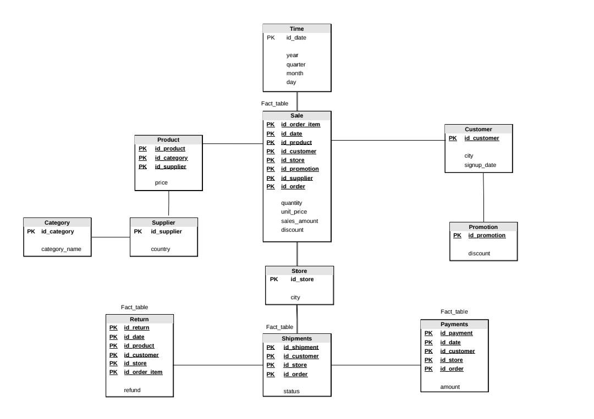

# Mini-Project
For Datawarehouse
# Presentation
https://canva.link/u97bsquxyowjw6u
### สมาชิก
1.นางสาวกนกวรรณ ทองเทพ รหัสนักศึกษา 673020243-5
   
2.นายณัฐวุฒิ กำจัดภัย รหัสนักศึกษา 673020251-6
   
3.นางสาวณิรดา อนุนิวัฒน์ รหัสนักศึกษา 673020252-4
   
4.นายภูธิป ต้นโลห์ รหัสนักศึกษา 673020261-3

5.นางสาวสุพิชชา คำสิงห์ รหัสนักศึกษา 673020265-5

6.นายสุวิชชา ผาสุข รหัสนักศึกษา 673020267-1

7.นายอพิชัย อิ่มวงค์ รหัสนักศึกษา 673020269-7

slide canva : https://canva.link/drif8b1apsznvjm

## การออกแบบและพัฒนาคลังข้อมูลเพื่อวิเคราะห์ข้อมูลการขายในธุรกิจค้าปลีก (Retail Analytics: From OLTP to OLAP Data Warehouse)

   มีวัตถุประสงค์เพื่อออกแบบและพัฒนาระบบคลังข้อมูลสำหรับธุรกิจค้าปลีก โดยนำข้อมูลจากฐานข้อมูลปฏิบัติการ (OLTP) มาผ่านกระบวนการ ETL/ELT เพื่อทำความสะอาดและแปลงข้อมูล จากนั้นจัดเก็บข้อมูลใน Data Warehouse ที่ออกแบบด้วยแนวคิด Dimensional Modeling และ Star Schema ประกอบด้วย Fact Table และ Dimension Tables เพื่อรองรับการวิเคราะห์ข้อมูลในมิติต่าง ๆ เช่น เวลา สินค้า ลูกค้า และสาขา ระบบจะนำข้อมูลจาก Data Warehouse มาวิเคราะห์ด้วยแนวคิด OLAP และพัฒนา Interactive Dashboard เพื่อแสดงยอดขาย จำนวนคำสั่งซื้อ กำไร สินค้าขายดี และตัวชี้วัดทางธุรกิจอื่น ๆ สำหรับสนับสนุนการตัดสินใจทางธุรกิจ

### 1. Dataset & Operational Database
ความหมายของ Dataset

1. Dataset คือชุดข้อมูลที่นำมาใช้ในการทำโครงงาน โดย Dataset นี้เป็นข้อมูลเกี่ยวกับ การขายสินค้าและการดำเนินงานของร้านค้าปลีก (Retail) ซึ่งประกอบด้วยข้อมูลลูกค้า สินค้า ร้านค้า คำสั่งซื้อ การชำระเงิน การจัดส่ง และการคืนสินค้า

2. Dataset นี้เป็นข้อมูลของ ระบบการขายสินค้าของธุรกิจค้าปลีก โดยจำลองกระบวนการตั้งแต่ลูกค้าเข้ามาสั่งซื้อสินค้า จนถึงการชำระเงิน การจัดส่ง และการคืนสินค้า
ตารางหลักของ Dataset

| ลำดับ	| 	ตาราง	 | จำนวน Records	| จำนวน Columns	| 	รายละเอียด 	|
|-------|------------|------------------|-------------------|---------------|
|   1	|  employees |	1,000		    |	   3	        |   ข้อมูลพนักงาน |


2	   returns 	    30,000	           3	          ข้อมูลการคืนสินค้า
3	   products	    10,000	           4	          ข้อมูลสินค้า
4	   suppliers	200 	           2	          ข้อมูลผู้จัดจำหน่าย
5	   categories	30	               2	          ข้อมูลประเภทสินค้า
6	   promotions	50  	           2	          ข้อมูลโปรโมชั่น
7	   stores	    100 	           2	          ข้อมูลสาขา
8	   customers	50,000	           3	          ข้อมูลลูกค้า
9	   payments 	300,000	           3	          ข้อมูลการชำระเงิน
10	   orders	    300,000	           5	          ข้อมูลคำสั่งซื้อ
11	   order_items	600,000	           5	          รายละเอียดสินค้าในคำสั่งซื้อ
12	   shipments	300,000	           3	          ข้อมูลการจัดส่ง

Dataset หลักทั้ง 12 ตารางมีข้อมูลรวมทั้งหมด 1,631,380 Records และ 39 Columns

https://colab.research.google.com/drive/1cb03m3na2yEKvnH9-JK1oxXGFHjB0PGo#scrollTo=b8417809

3. OLTP (Online Transaction Processing)

OLTP (Online Transaction Processing) หรือ ระบบประมวลผลรายการธุรกรรมออนไลน์ เป็นระบบฐานข้อมูลที่ใช้สำหรับจัดเก็บและประมวลผลธุรกรรมที่เกิดขึ้นจากการดำเนินงานประจำวันขององค์กร โดยมีจุดมุ่งหมายเพื่อให้สามารถบันทึก แก้ไข และเรียกใช้ข้อมูลธุรกรรมได้อย่างรวดเร็ว ถูกต้อง และเป็นระบบ รวมถึงสามารถรองรับธุรกรรมจำนวนมากและการทำงานของผู้ใช้งานหลายคนพร้อมกัน

สำหรับ Dataset ที่นำมาใช้ในโครงงานนี้ มีลักษณะเป็นข้อมูลของ ระบบธุรกิจค้าปลีก (Retail Business) ซึ่งประกอบด้วยข้อมูลลูกค้า สินค้า ร้านค้า พนักงาน ผู้จัดจำหน่าย ประเภทสินค้า โปรโมชั่น ตลอดจนข้อมูลการสั่งซื้อ การชำระเงิน การจัดส่ง และการคืนสินค้า โดย Dataset หลักประกอบด้วย 12 ตาราง จำนวนรวม 1,631,380 Records และ 39 Columns

จากการศึกษาลักษณะและโครงสร้างของข้อมูล พบว่า Dataset มีความสอดคล้องกับระบบ OLTP เนื่องจากมีทั้ง ข้อมูลหลัก (Master Data) และ ข้อมูลธุรกรรม (Transaction Data) ซึ่งทำงานเชื่อมโยงกันเพื่อรองรับกระบวนการขายสินค้า

3.1 ข้อมูลหลัก (Master Data)

ข้อมูลหลักเป็นข้อมูลที่ใช้ประกอบการทำธุรกรรมและไม่ได้เกิดขึ้นใหม่ทุกครั้งที่มีการซื้อสินค้า ประกอบด้วยตารางต่าง ๆ ดังนี้

-`customers     ใช้จัดเก็บข้อมูลลูกค้า      เช่น customer_id, city และ signup_date มีจำนวน 50,000 Records`
-`products      ใช้จัดเก็บข้อมูลสินค้า      เช่น product_id, category_id, supplier_id และ price มีจำนวน 10,000 Records`
-categories    ใช้จัดเก็บประเภทสินค้า         มีจำนวน 30 Records
-suppliers     ใช้จัดเก็บข้อมูลผู้จัดจำหน่าย     มีจำนวน 200 Records
-stores        ใช้จัดเก็บข้อมูลสาขา          มีจำนวน 100 Records
-employees     ใช้จัดเก็บข้อมูลพนักงาน        มีจำนวน 1,000 Records
-promotions    ใช้จัดเก็บข้อมูลโปรโมชั่น       มีจำนวน 50 Records

ข้อมูลเหล่านี้จะถูกนำมาใช้ประกอบการทำธุรกรรม เช่น เมื่อมีการสั่งซื้อสินค้า ระบบจะนำข้อมูลลูกค้า สินค้า สาขา และโปรโมชั่นที่เกี่ยวข้องมาเชื่อมโยงกับคำสั่งซื้อ

3.2 ข้อมูลธุรกรรม (Transaction Data)

ข้อมูลธุรกรรมเป็นข้อมูลที่เกิดขึ้นจากกิจกรรมต่าง ๆ ของระบบ โดยมีการเพิ่มข้อมูลเมื่อเกิดเหตุการณ์ใหม่ เช่น การสั่งซื้อ การชำระเงิน หรือการจัดส่ง ประกอบด้วย

orders ใช้บันทึกข้อมูลคำสั่งซื้อ ประกอบด้วย order_id, customer_id, store_id, order_date และ promotion_id มีจำนวน 300,000 Records
order_items ใช้บันทึกรายละเอียดสินค้าในแต่ละคำสั่งซื้อ ประกอบด้วย order_item_id, order_id, product_id, qty และ price มีจำนวน 600,000 Records
payments ใช้บันทึกข้อมูลการชำระเงิน ประกอบด้วย payment_id, order_id และ amount มีจำนวน 300,000 Records
shipments ใช้บันทึกข้อมูลการจัดส่ง ประกอบด้วย shipment_id, order_id และ status มีจำนวน 300,000 Records
returns ใช้บันทึกข้อมูลการคืนสินค้า ประกอบด้วย return_id, order_item_id และ refund มีจำนวน 30,000 Records

ตารางเหล่านี้มีความสำคัญต่อระบบ OLTP เนื่องจากเป็นข้อมูลที่เกิดขึ้นจากธุรกรรมโดยตรงและมีการบันทึกข้อมูลเป็นรายรายการ

3.3 กระบวนการทำงานของ OLTP ใน Dataset

การทำงานของระบบสามารถอธิบายเป็นกระบวนการตั้งแต่ลูกค้าทำการสั่งซื้อจนถึงการจัดส่งสินค้าได้ดังนี้

ขั้นตอนที่ 1 ลูกค้า

ลูกค้าถูกจัดเก็บในตาราง customers โดยมี customer_id เป็นรหัสสำหรับระบุลูกค้าแต่ละราย

↓

ขั้นตอนที่ 2 การสั่งซื้อสินค้า

เมื่อลูกค้าทำการสั่งซื้อ ระบบจะสร้างข้อมูลในตาราง orders โดยกำหนด order_id เพื่อระบุคำสั่งซื้อแต่ละรายการ และเชื่อมโยงกับ customer_id เพื่อระบุว่าคำสั่งซื้อเป็นของลูกค้ารายใด

↓

ขั้นตอนที่ 3 การบันทึกรายการสินค้า

รายละเอียดสินค้าที่อยู่ภายในคำสั่งซื้อจะถูกบันทึกใน order_items โดยใช้ order_id เชื่อมโยงกับคำสั่งซื้อ และใช้ product_id เชื่อมโยงกับข้อมูลสินค้าใน products

↓

ขั้นตอนที่ 4 การชำระเงิน

เมื่อมีการชำระเงิน ระบบจะบันทึกข้อมูลลงใน payments โดยใช้ order_id เพื่อระบุว่าการชำระเงินนั้นเกี่ยวข้องกับคำสั่งซื้อใด

↓

ขั้นตอนที่ 5 การจัดส่ง

เมื่อดำเนินการจัดส่ง ระบบจะสร้างข้อมูลใน shipments และใช้ status เพื่อระบุสถานะของการจัดส่ง

↓

ขั้นตอนที่ 6 การคืนสินค้า

หากลูกค้าต้องการคืนสินค้า ระบบจะบันทึกข้อมูลใน returns และใช้ order_item_id เพื่อระบุว่าสินค้าที่คืนเป็นรายการใดในคำสั่งซื้อ
ดังนั้น กระบวนการโดยรวมสามารถแสดงได้ดังนี้

Customer → Order → Order Item → Payment → Shipment → Return

3.4 ความสัมพันธ์ของข้อมูลที่สนับสนุนการทำงานแบบ OLTP

อีกหนึ่งลักษณะสำคัญของ Dataset คือการมีการเชื่อมโยงข้อมูลระหว่างตารางผ่านรหัสประจำข้อมูล เช่น

customer_id เชื่อมโยงข้อมูลลูกค้ากับคำสั่งซื้อ
order_id เชื่อมโยงคำสั่งซื้อกับรายละเอียดสินค้า การชำระเงิน และการจัดส่ง
product_id เชื่อมโยงรายการสินค้าเข้ากับข้อมูลสินค้า
category_id เชื่อมโยงสินค้าเข้ากับประเภทสินค้า
supplier_id เชื่อมโยงสินค้าเข้ากับผู้จัดจำหน่าย
store_id เชื่อมโยงคำสั่งซื้อและพนักงานกับสาขา
promotion_id เชื่อมโยงคำสั่งซื้อกับโปรโมชั่น
order_item_id เชื่อมโยงรายการสินค้าเข้ากับข้อมูลการคืนสินค้า

การแบ่งข้อมูลออกเป็นหลายตารางและเชื่อมโยงกันดังกล่าวช่วยลดการจัดเก็บข้อมูลซ้ำซ้อน และทำให้สามารถจัดการข้อมูลแต่ละส่วนได้อย่างเป็นระบบ

3.5 เหตุผลที่ Dataset มีลักษณะเป็น OLTP

จากการตรวจสอบ Dataset สามารถระบุเหตุผลที่สนับสนุนว่า Dataset นี้มีลักษณะเป็น OLTP ได้ดังนี้

ประการที่หนึ่ง Dataset มีตารางที่ใช้บันทึกธุรกรรมโดยตรง เช่น orders, order_items, payments, shipments และ returns

ประการที่สอง มีตารางข้อมูลหลัก เช่น customers, products, stores, categories, suppliers, employees และ promotions ซึ่งทำหน้าที่สนับสนุนการทำธุรกรรม

ประการที่สาม ข้อมูลมีรายละเอียดในระดับรายการธุรกรรม เช่น order_items สามารถระบุได้ว่าคำสั่งซื้อหนึ่งรายการประกอบด้วยสินค้าอะไร จำนวนเท่าใด และราคาเท่าใด

ประการที่สี่ Dataset มีจำนวนข้อมูลค่อนข้างมาก โดยมีข้อมูลรวม 1,631,380 Records ซึ่งส่วนใหญ่เป็นข้อมูลธุรกรรม เช่น order_items จำนวน 600,000 Records และ orders, payments และ shipments ตารางละ 300,000 Records

ประการที่ห้า ตารางต่าง ๆ มีการเชื่อมโยงข้อมูลด้วยรหัส เช่น order_id, customer_id และ product_id ซึ่งเป็นลักษณะสำคัญของฐานข้อมูลที่ใช้จัดการธุรกรรม

ประการที่หก โครงสร้างของ Dataset สามารถสะท้อนกระบวนการดำเนินงานของธุรกิจค้าปลีกตั้งแต่การสั่งซื้อ การบันทึกรายการสินค้า การชำระเงิน การจัดส่ง และการคืนสินค้า

3.6 สรุปการวิเคราะห์ OLTP

จากการวิเคราะห์ Dataset พบว่า Dataset มีลักษณะสอดคล้องกับ OLTP (Online Transaction Processing) เนื่องจากเป็นข้อมูลที่ใช้สนับสนุนกระบวนการดำเนินงานของธุรกิจค้าปลีก โดยมีทั้งข้อมูลหลักและข้อมูลธุรกรรมที่มีการเชื่อมโยงกันอย่างเป็นระบบ

ข้อมูลธุรกรรมที่สำคัญ ได้แก่ orders, order_items, payments, shipments และ returns ซึ่งทำหน้าที่บันทึกเหตุการณ์ต่าง ๆ ที่เกิดขึ้นจากการดำเนินงาน ขณะที่ customers, products, categories, suppliers, stores, employees และ promotions ทำหน้าที่เป็นข้อมูลหลักที่ใช้ประกอบการทำธุรกรรม

นอกจากนี้ Dataset ยังมีการเชื่อมโยงข้อมูลผ่านรหัสต่าง ๆ เช่น customer_id, order_id, product_id และ store_id ทำให้สามารถติดตามข้อมูลของธุรกรรมตั้งแต่การสั่งซื้อจนถึงการชำระเงิน การจัดส่ง และการคืนสินค้าได้

ดังนั้น Dataset นี้สามารถจัดอยู่ในลักษณะของฐานข้อมูล OLTP สำหรับระบบค้าปลีก เนื่องจากมีโครงสร้างที่มุ่งเน้นการจัดเก็บข้อมูลธุรกรรมที่เกิดขึ้นในแต่ละวัน มีข้อมูลในระดับรายละเอียดของ Transaction และมีความสัมพันธ์ระหว่างข้อมูลหลายตารางเพื่อสนับสนุนกระบวนการทำงานของระบบค้าปลีกอย่างเป็นระบบและมีประสิทธิภาพ


## 2. ER Diagram (หลิน) 


## Database Relationships

| Table | Relationship | Table |
|---|:---:|---|
| categories | 1:N | products |
| suppliers | 1:N | products |
| products | 1:N | order_items |
| orders | 1:N | order_items |
| order_items | 1:N | returns |
| customers | 1:N | orders |
| stores | 1:N | orders |
| promotions | 1:N | orders |
| orders | 1:N | payments |
| orders | 1:N | shipments |
| stores | 1:N | employees |

## 3.Business Questions (ฟีฟ่า)


## 4.Business Process and Multidimensional Data Model

### 4.1 Business Process

จากการวิเคราะห์ระบบขายปลีก พบว่าข้อมูลสามารถแบ่งออกเป็นกระบวนการทางธุรกิจหลักที่เกี่ยวข้องกับการวิเคราะห์ใน Dashboard ดังนี้

#### 1. Sales Process

กระบวนการขายสินค้าเป็น Business Process หลักของระบบ โดยใช้ข้อมูลจาก `Orders` และ `Order Items` เพื่อวิเคราะห์ยอดขาย จำนวนสินค้าที่ขาย รายได้ตามสินค้า หมวดหมู่ ลูกค้า ร้านค้า โปรโมชั่น และซัพพลายเออร์

ข้อมูลหลักที่เกี่ยวข้อง:
- `Orders`
- `Order Items`
- `Products`
- `Categories`
- `Customers`
- `Stores`
- `Promotions`
- `Suppliers`

ตัวชี้วัดสำคัญ:
- Total Sales / Revenue
- Monthly Revenue
- Product Revenue
- Units Sold
- Category Revenue
- Store Revenue
- Customer Revenue
- Average Order Value (AOV)
- Sales Growth Rate
- Promotion Revenue
- Supplier Revenue

Grain ของ Sales Process:

> 1 แถวใน Fact_Sales แทนสินค้า 1 รายการใน 1 Order Line Item (One Order Line Item)


#### 2. Return Process

กระบวนการคืนสินค้าใช้ข้อมูลจาก `Returns` ซึ่งเชื่อมโยงกับ `Order Items` เพื่อวิเคราะห์จำนวนและมูลค่าการคืนสินค้า รวมถึงใช้เปรียบเทียบกับยอดขายเพื่อคำนวณ Return Rate

ข้อมูลหลักที่เกี่ยวข้อง:
- `Returns`
- `Order Items`
- `Orders`
- `Products`
- `Customers`
- `Stores`

ตัวชี้วัดสำคัญ:
- Returned Quantity
- Refund Amount
- Return Rate

Grain ของ Return Process:

> 1 แถวใน Fact_Returns แทน 1 รายการการคืนสินค้า (One Return Transaction)

หมายเหตุ: ตาราง `Returns` ในระบบไม่มีข้อมูลสาเหตุการคืนสินค้า (`return_reason`) ดังนั้นไม่สามารถวิเคราะห์ Return Rate by Reason ได้จากข้อมูลปัจจุบัน


#### 3. Shipment Process

กระบวนการจัดส่งสินค้าใช้ข้อมูลจาก `Shipments` ซึ่งเชื่อมโยงกับ `Orders` เพื่อวิเคราะห์สถานะของการจัดส่งสินค้า

ข้อมูลหลักที่เกี่ยวข้อง:
- `Shipments`
- `Orders`
- `Customers`
- `Stores`

ตัวชี้วัด/ข้อมูลที่สามารถวิเคราะห์ได้:
- Shipment Status
- จำนวน Shipment ตามสถานะ
- สัดส่วน Shipment ตามสถานะ

Grain ของ Shipment Process:

> 1 แถวใน Fact_Shipments แทน 1 รายการจัดส่งสินค้า (One Shipment)

หมายเหตุ: ตาราง `Shipments` มีเพียง `shipment_id`, `order_id` และ `status` ไม่มีข้อมูลวันที่คาดว่าจะจัดส่งหรือวันที่จัดส่งจริง ดังนั้นจึงไม่สามารถคำนวณ On-Time Delivery Rate หรือ Average Delivery Time ได้จากข้อมูลปัจจุบัน


#### 4. Payment Process

กระบวนการชำระเงินใช้ข้อมูลจาก `Payments` ซึ่งเชื่อมโยงกับ `Orders` เพื่อวิเคราะห์จำนวนเงินที่ชำระในแต่ละรายการ

ข้อมูลหลักที่เกี่ยวข้อง:
- `Payments`
- `Orders`

ตัวชี้วัดสำคัญ:
- Payment Amount
- Number of Payment Transactions

Grain ของ Payment Process:

> 1 แถวใน Fact_Payments แทน 1 รายการธุรกรรมการชำระเงิน (One Payment Transaction)

หมายเหตุ: ตาราง `Payments` ไม่มีข้อมูล `payment_method` ดังนั้นไม่สามารถวิเคราะห์ Payment Method Usage ตามประเภทวิธีการชำระเงินได้จากข้อมูลปัจจุบัน.


---

## 4.2 Multidimensional Data Model

จาก Business Process ที่วิเคราะห์ สามารถออกแบบ Multidimensional Data Model โดยแบ่งข้อมูลออกเป็น **Fact Tables** และ **Dimension Tables** เพื่อรองรับการวิเคราะห์ข้อมูลใน Dashboard

โครงสร้างโดยรวมเป็น **Fact Constellation / Galaxy Schema** เนื่องจากระบบมีหลาย Fact Tables ที่รองรับ Business Processes ที่แตกต่างกัน และมี Dimension ที่สามารถใช้ร่วมกันระหว่างหลาย Fact Tables

---

### 4.2.1 Fact Tables

ระบบประกอบด้วย Fact Tables หลัก 4 ตาราง ได้แก่

- `Fact_Sales`
- `Fact_Returns`
- `Fact_Shipments`
- `Fact_Payments`

---

#### 1. Fact_Sales

ใช้เก็บข้อมูลธุรกรรมการขายสินค้า

**Grain:**

> 1 แถว = 1 สินค้าใน 1 Order Line Item (One Order Line Item)

**Keys:**

- `order_item_id`
- `order_id`
- `product_id`
- `order_date`
- `customer_id`
- `store_id`
- `promotion_id`
- `supplier_id`

**Measures:**

- `quantity` — จำนวนสินค้าที่ขาย
- `unit_price` — ราคาขายต่อหน่วย
- `sales_amount` — มูลค่าการขาย

**Additional Attribute:**

- `discount` — ค่า Discount จาก Promotion

**Sales Amount Calculation:**

```text
sales_amount = quantity × unit_price
```

โดย `sales_amount` เป็นมูลค่าการขายที่คำนวณจาก `quantity × unit_price` และไม่ได้หัก `discount` ออกโดยอัตโนมัติ

**Calculated Measures:**

- Total Revenue = `SUM(sales_amount)`
- Units Sold = `SUM(quantity)`
- Order Count = `COUNT(DISTINCT order_id)`
- Average Selling Price = `SUM(sales_amount) / SUM(quantity)`
- Average Order Value (AOV) = `SUM(sales_amount) / COUNT(DISTINCT order_id)`
- Sales Growth Rate

> `Promotion Revenue`, `Supplier Revenue`, `Category Revenue`, `Monthly Revenue` และ `Quarterly Revenue` เป็นการนำ `sales_amount` ไป Aggregate ตาม Dimension ที่ต้องการ ไม่ใช่ Base Measure ใหม่

---

#### 2. Fact_Returns

ใช้เก็บข้อมูลธุรกรรมการคืนสินค้า

**Grain:**

> 1 แถว = 1 Return Transaction

**Keys:**

- `return_id`
- `order_item_id`
- `order_id`
- `product_id`
- `customer_id`
- `store_id`
- `order_date`

**Measure:**

- `refund` — จำนวนเงินที่คืนให้ลูกค้า

**Calculated Measures:**

- Total Refund = `SUM(refund)`
- Return Transaction Count = `COUNT(return_id)`

> **หมายเหตุ:** Source Dataset ไม่มี `returned_quantity`, `return_date` และ `return_reason` จึงไม่สร้างข้อมูลดังกล่าวขึ้นมาเอง
>
> `order_date` ใน Fact_Returns หมายถึงวันที่ของ Order ที่เกี่ยวข้องกับ Return ไม่ใช่วันที่ทำรายการ Return

---

#### 3. Fact_Shipments

ใช้เก็บข้อมูลธุรกรรมการจัดส่งสินค้า

**Grain:**

> 1 แถว = 1 Shipment

**Keys:**

- `shipment_id`
- `order_id`
- `customer_id`
- `store_id`

**Attribute:**

- `status` — สถานะการจัดส่ง

**Measure:**

- Shipment Count = `COUNT(shipment_id)`

**Calculated Measure:**

- Shipment Status Rate

```text
Shipment Status Rate =
Shipment Count by Status / Total Shipment Count × 100
```

> **หมายเหตุ:** `status` เป็น Attribute ที่อยู่ใน Fact_Shipments เนื่องจาก Source Dataset ไม่มีข้อมูลที่จำเป็นสำหรับสร้าง Dimension Status แยกต่างหาก
>
> Source Dataset ไม่มี `shipment_date` หรือ `delivery_date` ดังนั้นไม่สามารถคำนวณ `On-Time Delivery Rate` หรือ `Average Delivery Time` ได้จากข้อมูลปัจจุบัน

---

#### 4. Fact_Payments

ใช้เก็บข้อมูลธุรกรรมการชำระเงิน

**Grain:**

> 1 แถว = 1 Payment Transaction

**Keys:**

- `payment_id`
- `order_id`
- `customer_id`
- `store_id`
- `order_date`

**Measure:**

- `amount` — จำนวนเงินที่ชำระ

**Calculated Measures:**

- Total Payment Amount = `SUM(amount)`
- Payment Transaction Count = `COUNT(payment_id)`

> **หมายเหตุ:** `order_date` ใน Fact_Payments เป็นวันที่ของ Order ที่เชื่อมโยงกับ Payment ไม่ใช่ Payment Date เนื่องจาก Source Dataset ไม่มี Payment Date
>
> Source Dataset ไม่มี `payment_method` ดังนั้นไม่สามารถวิเคราะห์ Payment Method Usage ตามประเภทวิธีการชำระเงินได้จากข้อมูลปัจจุบัน

---

### 4.2.2 Dimension Tables

ระบบประกอบด้วย Dimension Tables ดังนี้

- `Dim_Date`
- `Dim_Product`
- `Dim_Category`
- `Dim_Customer`
- `Dim_Store`
- `Dim_Promotion`
- `Dim_Supplier`
- `Dim_Employee`

---

#### 1. Dim_Date

ใช้สำหรับวิเคราะห์ข้อมูลตามช่วงเวลา

**Primary Key:**

- `date_id`

**Attributes:**

- `order_date`
- `day`
- `month`
- `quarter`
- `year`

**Hierarchy:**

```text
Year → Quarter → Month → Day
```

ใช้สำหรับวิเคราะห์ข้อมูลตามวัน เดือน ไตรมาส และปี

---

#### 2. Dim_Product

ใช้สำหรับวิเคราะห์ข้อมูลตามสินค้า

**Primary Key:**

- `product_id`

**Attributes:**

- `category_id`
- `supplier_id`
- `price`

ใช้สำหรับวิเคราะห์ยอดขายและจำนวนสินค้าตาม Product และเชื่อมโยงข้อมูลกับ Category และ Supplier

---

#### 3. Dim_Category

ใช้สำหรับวิเคราะห์ข้อมูลตามหมวดหมู่สินค้า

**Primary Key:**

- `category_id`

**Attributes:**

- `category_name` หากมีอยู่ใน Source Dataset

ใช้สำหรับวิเคราะห์:

- Category Revenue
- Units Sold
- Sales by Category

> `category_name` ใช้เมื่อ Column ดังกล่าวมีอยู่ใน Source Dataset

---

#### 4. Dim_Customer

ใช้สำหรับวิเคราะห์ข้อมูลลูกค้า

**Primary Key:**

- `customer_id`

**Attributes:**

- `city`
- `signup_date`

ใช้สำหรับวิเคราะห์:

- Customer Revenue
- Active Customer Count
- Customer AOV

---

#### 5. Dim_Store

ใช้สำหรับวิเคราะห์ข้อมูลร้านค้า เมือง และภูมิภาค

**Primary Key:**

- `store_id`

**Attributes:**

- `city`
- `region`

**Hierarchy:**

```text
Region → City → Store
```

ใช้สำหรับวิเคราะห์:

- Store Revenue
- Store AOV
- Refund by Store
- Sales by Region

---

#### 6. Dim_Promotion

ใช้สำหรับวิเคราะห์ข้อมูล Promotion

**Primary Key:**

- `promotion_id`

**Attributes:**

- `discount`

ใช้สำหรับวิเคราะห์:

- Promotion Revenue
- Promotion Performance

---

#### 7. Dim_Supplier

ใช้สำหรับวิเคราะห์ข้อมูล Supplier และประเทศของ Supplier

**Primary Key:**

- `supplier_id`

**Attributes:**

- `country`

**Hierarchy:**

```text
Country → Supplier
```

ใช้สำหรับวิเคราะห์:

- Supplier Revenue
- Supplier Revenue by Country
- Supplier Revenue by Category

---

#### 8. Dim_Employee

ใช้สำหรับเก็บข้อมูลพนักงานและความสัมพันธ์กับ Store

**Primary Key:**

- `employee_id`

**Attributes:**

- `store_id`
- `salary`

> **หมายเหตุ:** Source Dataset ไม่มี `employee_id` ใน `Orders` หรือ `Order Items` ดังนั้น `Dim_Employee` ไม่ได้เชื่อมกับ `Fact_Sales` และไม่สามารถวิเคราะห์ Sales per Employee ได้โดยตรง

---

### 4.2.3 Measures and Measure Types

Measures คือค่าตัวเลขที่ใช้วัดและวิเคราะห์ข้อมูลใน Fact Tables

#### Fact_Sales Measures

| Measure | Description | Type |
|---|---|---|
| `quantity` | จำนวนสินค้าที่ขาย | Additive |
| `sales_amount` | มูลค่าการขาย | Additive |
| `unit_price` | ราคาขายต่อหน่วย | Non-Additive |
| `discount` | ค่า Discount | ขึ้นอยู่กับความหมายของ Source |

**Calculated Measures:**

| Calculated Measure | Formula | Type |
|---|---|---|
| Total Revenue | `SUM(sales_amount)` | Additive |
| Units Sold | `SUM(quantity)` | Additive |
| Order Count | `COUNT(DISTINCT order_id)` | Non-Additive |
| Average Selling Price | `SUM(sales_amount) / SUM(quantity)` | Non-Additive |
| AOV | `SUM(sales_amount) / COUNT(DISTINCT order_id)` | Non-Additive |
| Sales Growth Rate | `(Current Sales - Previous Sales) / Previous Sales × 100` | Non-Additive |

> `Monthly Revenue`, `Quarterly Revenue`, `Category Revenue`, `Promotion Revenue` และ `Supplier Revenue` เป็นการ Aggregate จาก `sales_amount` ตาม Dimension ที่ใช้วิเคราะห์

---

#### Fact_Returns Measures

| Measure | Description | Type |
|---|---|---|
| `refund` | จำนวนเงินที่คืน | Additive |

**Calculated Measures:**

| Calculated Measure | Formula | Type |
|---|---|---|
| Total Refund | `SUM(refund)` | Additive |
| Return Transaction Count | `COUNT(return_id)` | Additive |

---

#### Fact_Shipments Measures

| Measure | Description | Type |
|---|---|---|
| Shipment Count | จำนวน Shipment | Additive |

**Calculated Measure:**

| Calculated Measure | Formula | Type |
|---|---|---|
| Shipment Status Rate | `Shipment Count by Status / Total Shipment Count × 100` | Non-Additive |

---

#### Fact_Payments Measures

| Measure | Description | Type |
|---|---|---|
| `amount` | จำนวนเงินที่ชำระ | Additive |

**Calculated Measures:**

| Calculated Measure | Formula | Type |
|---|---|---|
| Total Payment Amount | `SUM(amount)` | Additive |
| Payment Transaction Count | `COUNT(payment_id)` | Additive |

---

### 4.2.4 Dimension Hierarchy Summary

| Dimension | Hierarchy |
|---|---|
| `Dim_Date` | Year → Quarter → Month → Day |
| `Dim_Store` | Region → City → Store |
| `Dim_Supplier` | Country → Supplier |

---

### 4.2.5 Overall Multidimensional Model

โครงสร้างโดยรวมเป็น **Fact Constellation / Galaxy Schema** เนื่องจากมีหลาย Fact Tables ที่รองรับ Business Processes ที่แตกต่างกัน และมี Dimension ที่สามารถใช้ร่วมกันระหว่างหลาย Fact Tables

- `Fact_Sales` — Sales Process
- `Fact_Returns` — Return Process
- `Fact_Shipments` — Shipment Process
- `Fact_Payments` — Payment Process

Dimensions ที่ใช้ร่วมกันตามความเหมาะสม ได้แก่

- `Dim_Date`
- `Dim_Customer`
- `Dim_Store`
- `Dim_Product`

และ Dimensions ที่ใช้สำหรับการวิเคราะห์เฉพาะด้าน ได้แก่

- `Dim_Category`
- `Dim_Promotion`
- `Dim_Supplier`
- `Dim_Employee`

### Schema Structure

```text
                         Dim_Date
                            |
                            ▼
                       Fact_Sales
                    /      |       \
                   ▼       ▼        ▼
             Dim_Product Dim_Customer Dim_Store
                  |
                  ▼
             Dim_Category
                  |
                  ▼
             Dim_Supplier

             Dim_Promotion
                  |
                  ▼
             Fact_Sales


             Dim_Customer
                  |
                  ▼
             Fact_Returns
                  ▲
                  |
              Dim_Store


             Dim_Customer
                  |
                  ▼
             Fact_Shipments
                  ▲
                  |
              Dim_Store


             Dim_Date
                  |
                  ▼
             Fact_Payments
             /            \
            ▼              ▼
      Dim_Customer      Dim_Store
```

> Fact Tables ไม่มีการเชื่อมต่อกันโดยตรง แต่ใช้ Dimension Tables เป็น Conformed Dimensions สำหรับการวิเคราะห์ข้อมูลร่วมกัน
>
> `Dim_Product` มีความสัมพันธ์กับ `Dim_Category` และ `Dim_Supplier` เพื่อเชื่อมโยงข้อมูลสินค้า หมวดหมู่ และ Supplier โดยโครงสร้างโดยรวมของ Data Warehouse ยังคงเป็น **Fact Constellation / Galaxy Schema**


> **Schema Type:** Fact Constellation / Galaxy Schema

> **Design Principle:** แต่ละ Fact Table มี Grain ที่ชัดเจน และใช้ Dimension เป็นมุมมองสำหรับการวิเคราะห์ Measures จากแต่ละ Business Process
### Data Model Diagram (Galaxy Scheme) แซนด์วิช


## การดำเนินงานด้านการจัดการข้อมูลด้วยกระบวนการ ELT

## 1. กระบวนการ ELT (ELT Process)

1.1 หลักการและแนวคิดของ ELT

โครงงานนี้ใช้กระบวนการ ELT (Extract, Load, Transform) ในการจัดการข้อมูล โดยมีวัตถุประสงค์เพื่อรวบรวมข้อมูลจากระบบต้นทาง จัดเก็บข้อมูลในฐานข้อมูล และดำเนินการทำความสะอาดและแปลงข้อมูลภายหลังจากที่ข้อมูลถูก Load เข้าสู่ฐานข้อมูลแล้ว

ELT ประกอบด้วย 3 ขั้นตอนหลัก ได้แก่

Extract – การดึงข้อมูลจากแหล่งข้อมูลต้นทาง
Load – การนำข้อมูลเข้าสู่ฐานข้อมูลในรูปแบบ Raw/Staging
Transform – การทำความสะอาด แปลง และจัดโครงสร้างข้อมูลเพื่อเตรียมเข้าสู่ Data Warehouse

| ขั้นตอน (Stage) | ชื่อชั้นข้อมูล (Layer Name) | เครื่องมือ / เทคโนโลยี (Tools) | หน้าที่และการทำงาน (Function / Tasks) |
| :--- | :--- | :--- | :--- |
| **1. Source** | **แหล่งข้อมูลต้นทาง** | Google Drive / CSV Files | จัดเก็บไฟล์ข้อมูลดิบรูปแบบ CSV บน Google Drive พร้อมสำหรับการดึงไปใช้งาน |
| **2. Extract** | **Raw / Staging** | DuckDB | ทำการดึงข้อมูลดิบ (Extract) เข้าสู่พื้นที่พักข้อมูล (Staging Area) เพื่อเตรียมนำไปแปลงสภาพ |
| **3. Transform** | **Transform Layer** | Data Processing Engine | ทำการทำความสะอาดข้อมูล (Cleaning), เชื่อมโยงข้อมูล (Join), แปลงชนิดข้อมูล (Type Conversion) และคำนวณค่าต่างๆ (Calculation) |
| **4. Storage** | **Data Warehouse** | Relational / Analytical DB | จัดเก็บข้อมูลที่ผ่านการแปลงแล้วลงในรูปแบบ **Fact Tables** (ตารางข้อเท็จจริง) และ **Dimension Tables** (ตารางมิติ) |
| **5. Output** | **Analysis** | BI Tools / Dashboards / SQL | นำข้อมูลที่จัดเก็บใน Data Warehouse ไปวิเคราะห์ ทำรายงาน หรือนำเสนอต่อผู้ใช้งาน |

## 1.2 โครงสร้าง Dataset

Dataset ที่ใช้ในโครงงานเป็นข้อมูลระบบค้าปลีก ประกอบด้วยข้อมูลเกี่ยวกับลูกค้า สินค้า ร้านค้า คำสั่งซื้อ การชำระเงิน การจัดส่ง การคืนสินค้า โปรโมชั่น และข้อมูลที่เกี่ยวข้องกับการดำเนินงานของธุรกิจค้าปลีก

จากการตรวจสอบข้อมูลพบ 12 ตารางหลัก ดังนี้
นอกจากนี้ยังพบไฟล์ข้อมูลประเภท TXT และ ZIP ซึ่งเป็นข้อมูลตัวอย่างขนาดเล็ก จึงแยกออกจาก Dataset หลักเพื่อให้การวิเคราะห์โครงสร้างฐานข้อมูลค้าปลีกมีความชัดเจน

| ลำดับ | ตาราง | Records | Columns | ประเภทข้อมูล |
| :---: | :--- | :---: | :---: | :---: |
| 1 | employees | 1,000 | 3 | Master |
| 2 | returns | 30,000 | 3 | Transaction |
| 3 | products | 10,000 | 4 | Master |
| 4 | suppliers | 200 | 2 | Master |
| 5 | categories | 30 | 2 | Master |
| 6 | promotions | 50 | 2 | Master |
| 7 | stores | 100 | 2 | Master |
| 8 | customers | 50,000 | 3 | Master |
| 9 | payments | 300,000 | 3 | Transaction |
| 10 | orders | 300,000 | 5 | Transaction |
| 11 | order_items | 600,000 | 5 | Transaction |
| 12 | shipments | 300,000 | 3 | Transaction |

รวมข้อมูลทั้งหมด
<1,591,380 Records และ 39 Columns>

Markdown
# Retail Data Warehouse

## 1. Project Overview
โปรเจกต์นี้เป็นการพัฒนา Retail Data Warehouse สำหรับรวบรวม จัดเตรียม และวิเคราะห์ข้อมูลธุรกิจค้าปลีก โดยใช้แนวคิด ELT (Extract, Load, Transform) ร่วมกับ **dbt** และ **DuckDB**

ข้อมูลต้นทางอยู่ในรูปแบบ CSV จำนวน 12 ตาราง และจัดเก็บไว้ใน GitHub Repository จากนั้นใช้ `dbt seed` ในการ Load ข้อมูลเข้าสู่ DuckDB และใช้ dbt Models ในการ Cleaning, Validation และ Transformation ก่อนสร้างเป็น Data Warehouse

```text
GitHub Repository
       │
       │ 12 CSV Files
       ▼
    EXTRACT
       │
       ▼
    dbt Seed
       │
       ▼
     DuckDB
       │
       ▼
  dbt Staging
       │
       ├── Cleaning
       ├── Data Type Conversion
       ├── Validation
       └── Data Quality Tests
       │
       ▼
   dbt Models
       │
       ├── Dimension Tables
       └── Fact Tables
       │
       ▼
 Data Warehouse
       │
       ▼
 BI / Analytics
2. Objectives
ลำดับ	วัตถุประสงค์
1	รวบรวมข้อมูลจาก Source Data จำนวน 12 ตาราง
2	จัดเก็บ Source Data ใน GitHub Repository
3	ใช้ dbt เป็นเครื่องมือหลักในการจัดการ ELT
4	ใช้ DuckDB เป็น Database และ Data Warehouse
5	ทำความสะอาดและตรวจสอบคุณภาพข้อมูล
6	แปลงข้อมูลให้อยู่ในรูปแบบ Dimension และ Fact Tables
7	สร้าง Data Warehouse สำหรับการวิเคราะห์ข้อมูล
8	รองรับการวิเคราะห์ข้อมูลด้วย SQL
9	รองรับการนำข้อมูลไปสร้าง Report และ Dashboard
3. Technologies
เทคโนโลยี	วัตถุประสงค์การใช้งาน
GitHub	จัดเก็บ Source Data และ Source Code
CSV	รูปแบบของ Source Data
dbt	ELT, Cleaning, Validation และ Transformation
DuckDB	Database และ Data Warehouse
SQL	Data Transformation และ Data Analysis
Python	Environment Setup และการเรียกใช้งาน Pipeline
4. Source Data
Source Data ประกอบด้วย CSV จำนวน 12 ตาราง โดยมีรายละเอียดโครงสร้างและประเภทข้อมูลดังนี้

ลำดับ	ตาราง	Records	Columns	ประเภทข้อมูล
1	employees	1,000	3	Master
2	returns	30,000	3	Transaction
3	products	10,000	4	Master
4	suppliers	200	2	Master
5	categories	30	2	Master
6	promotions	50	2	Master
7	stores	100	2	Master
8	customers	50,000	3	Master
9	payments	300,000	3	Transaction
10	orders	300,000	5	Transaction
11	order_items	600,000	5	Transaction
12	shipments	300,000	3	Transaction
5. Repository Structure
Plaintext
retail-data-warehouse/
│
├── seeds/
│   ├── employees.csv
│   ├── returns.csv
│   ├── products.csv
│   ├── suppliers.csv
│   ├── categories.csv
│   ├── promotions.csv
│   ├── stores.csv
│   ├── customers.csv
│   ├── payments.csv
│   ├── orders.csv
│   ├── order_items.csv
│   └── shipments.csv
│
├── models/
│   ├── staging/
│   │   ├── stg_employees.sql
│   │   ├── stg_returns.sql
│   │   ├── stg_products.sql
│   │   ├── stg_suppliers.sql
│   │   ├── stg_categories.sql
│   │   ├── stg_promotions.sql
│   │   ├── stg_stores.sql
│   │   ├── stg_customers.sql
│   │   ├── stg_payments.sql
│   │   ├── stg_orders.sql
│   │   └── stg_order_items.sql
│   │
│   └── marts/
│       ├── dim_date.sql
│       ├── dim_product.sql
│       ├── dim_category.sql
│       ├── dim_customer.sql
│       ├── dim_store.sql
│       ├── dim_promotion.sql
│       ├── dim_supplier.sql
│       ├── dim_employee.sql
│       ├── fact_sales.sql
│       ├── fact_return.sql
│       ├── fact_shipments.sql
│       └── fact_payments.sql
│
├── tests/
├── dbt_project.yml
├── profiles.yml
└── README.md
6. ELT Process
6.1 Extract
ข้อมูลต้นทางทั้งหมดถูกจัดเก็บเป็น CSV ใน GitHub Repository

ขั้นตอน	กระบวนการ	รายละเอียด
1	Source	ข้อมูลต้นทางในรูปแบบ CSV ทั้ง 12 ตาราง
2	GitHub	จัดเก็บ CSV เข้าสู่ GitHub Repository
3	Extract	dbt ดึงข้อมูลต้นทางจาก Repository
4	Output	ข้อมูลพร้อมสำหรับการ Load เข้า Database
6.2 Load
หลังจาก Source Data ถูกจัดเก็บใน Repository แล้ว จะใช้คำสั่ง dbt seed เพื่อ Load CSV เข้าสู่ DuckDB

ขั้นตอน	ข้อมูลขาเข้า (Input)	เครื่องมือ (Tool)	ข้อมูลขาออก (Output)
1	CSV Files	GitHub Repository	Source Data
2	Source Data	dbt seed	DuckDB
3	CSV Tables	DuckDB	Seed Tables
7. Data Warehouse Architecture
Dimension Tables (8 Tables)
ลำดับ	ตาราง Dimension	รายละเอียด
1	dim_date	ข้อมูลมิติด้านวันที่
2	dim_product	ข้อมูลมิติสินค้า
3	dim_category	ข้อมูลมิติหมวดหมู่สินค้า
4	dim_customer	ข้อมูลมิติลูกค้า
5	dim_store	ข้อมูลมิติสาขา
6	dim_promotion	ข้อมูลมิติโปรโมชั่น
7	dim_supplier	ข้อมูลมิติผู้จัดจำหน่าย
8	dim_employee	ข้อมูลมิติพนักงาน
Fact Tables (4 Tables)
ลำดับ	ตาราง Fact	Grain (ระดับความละเอียด)	รายละเอียด
1	fact_sales	1 Order Line Item	ข้อมูลข้อเท็จจริงเกี่ยวกับการขาย
2	fact_return	1 Return Transaction	ข้อมูลข้อเท็จจริงเกี่ยวกับการคืนสินค้า
3	fact_shipments	1 Shipment	ข้อมูลข้อเท็จจริงเกี่ยวกับการจัดส่ง
4	fact_payments	1 Payment Transaction	ข้อมูลข้อเท็จจริงเกี่ยวกับการชำระเงิน
8. Pipeline Commands
คำสั่ง (Command)	หน้าที่การทำงาน
dbt debug	ตรวจสอบ Configuration และการเชื่อมต่อ DuckDB
dbt seed	Load ข้อมูลจาก CSV เข้าสู่ DuckDB
dbt run	Transform ข้อมูลผ่าน dbt Models
dbt test	ตรวจสอบคุณภาพข้อมูล (Data Quality Check)
dbt build	(แนะนำ) Run ทุกกระบวนการ (Seed, Run, Test) ตามลำดับ Dependency
```
## Dashboard Link
https://dadamini-project-aj-perm-manifest-get-a.streamlit.app/
# Infographic


# Source
Datarspectrum Technology Training Center. (n.d.). Retail Data Warehouse – 12 Table 1M+ Rows Dataset [Data set]. Kaggle.
https://www.kaggle.com/datasets/datarspectrum/retail-data-warehouse-12-table-1m-rows-dataset


## ขั้นตอนการเข้าใช้งาน Codespace ( Dashboard )
1.เตรียม Virtual Environment 
   python -m venv venv
source venv/bin/activate  # สำหรับ Mac/Linux
2.ใช้ CD Retail_data เพื่อเข้าสู่โฟล์เดอร์ Retail_data
3.ใช้คำสั่ง streamlit run dashboard_app.py เพื่อเข้าสู่หน้า Dashboard
