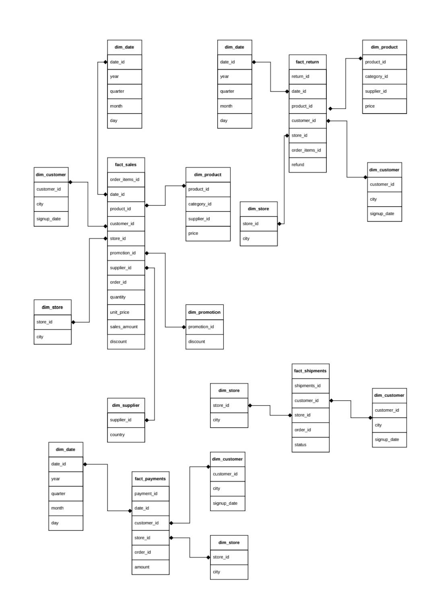

# Mini-Project
For Datawarehouse
### สมาชิก
1.นางสาวกนกวรรณ ทองเทพ รหัสนักศึกษา 673020243-5
   
2.นายณัฐวุฒิ กำจัดภัย รหัสนักศึกษา 673020251-6
   
3.นางสาวณิรดา อนุนิวัฒน์ รหัสนักศึกษา 673020252-4
   
4.นายภูธิป ต้นโลห์ รหัสนักศึกษา 673020261-3

5.นางสาวสุพิชชา คำสิงห์ รหัสนักศึกษา 673020265-5

6.นายสุวิชชา ผาสุข รหัสนักศึกษา 673020267-1

7.นายอพิชัย อิ่มวงค์ รหัสนักศึกษา 673020269-7

## การออกแบบและพัฒนาคลังข้อมูลเพื่อวิเคราะห์ข้อมูลการขายในธุรกิจค้าปลีก (Retail Analytics: From OLTP to OLAP Data Warehouse)

   มีวัตถุประสงค์เพื่อออกแบบและพัฒนาระบบคลังข้อมูลสำหรับธุรกิจค้าปลีก โดยนำข้อมูลจากฐานข้อมูลปฏิบัติการ (OLTP) มาผ่านกระบวนการ ETL/ELT เพื่อทำความสะอาดและแปลงข้อมูล จากนั้นจัดเก็บข้อมูลใน Data Warehouse ที่ออกแบบด้วยแนวคิด Dimensional Modeling และ Star Schema ประกอบด้วย Fact Table และ Dimension Tables เพื่อรองรับการวิเคราะห์ข้อมูลในมิติต่าง ๆ เช่น เวลา สินค้า ลูกค้า และสาขา ระบบจะนำข้อมูลจาก Data Warehouse มาวิเคราะห์ด้วยแนวคิด OLAP และพัฒนา Interactive Dashboard เพื่อแสดงยอดขาย จำนวนคำสั่งซื้อ กำไร สินค้าขายดี และตัวชี้วัดทางธุรกิจอื่น ๆ สำหรับสนับสนุนการตัดสินใจทางธุรกิจ

### 1. Dataset & Operational Database
ความหมายของ Dataset

1. Dataset คือชุดข้อมูลที่นำมาใช้ในการทำโครงงาน โดย Dataset นี้เป็นข้อมูลเกี่ยวกับ การขายสินค้าและการดำเนินงานของร้านค้าปลีก (Retail) ซึ่งประกอบด้วยข้อมูลลูกค้า สินค้า ร้านค้า คำสั่งซื้อ การชำระเงิน การจัดส่ง และการคืนสินค้า

2. Dataset นี้เป็นข้อมูลของ ระบบการขายสินค้าของธุรกิจค้าปลีก โดยจำลองกระบวนการตั้งแต่ลูกค้าเข้ามาสั่งซื้อสินค้า จนถึงการชำระเงิน การจัดส่ง และการคืนสินค้า
ตารางหลักของ Dataset

| ลำดับ	| 	ตาราง	 | จำนวน Records	| จำนวน Columns	| 	รายละเอียด 	|
|-------|------------|------------------|-------------------|---------------|
|   1	|  employees |	1,000		    |	   3	        |   ข้อมูลพนักงาน |


2	   returns 	    30,000	           3	          ข้อมูลการคืนสินค้า
3	   products	    10,000	           4	          ข้อมูลสินค้า
4	   suppliers	200 	           2	          ข้อมูลผู้จัดจำหน่าย
5	   categories	30	               2	          ข้อมูลประเภทสินค้า
6	   promotions	50  	           2	          ข้อมูลโปรโมชั่น
7	   stores	    100 	           2	          ข้อมูลสาขา
8	   customers	50,000	           3	          ข้อมูลลูกค้า
9	   payments 	300,000	           3	          ข้อมูลการชำระเงิน
10	   orders	    300,000	           5	          ข้อมูลคำสั่งซื้อ
11	   order_items	600,000	           5	          รายละเอียดสินค้าในคำสั่งซื้อ
12	   shipments	300,000	           3	          ข้อมูลการจัดส่ง

Dataset หลักทั้ง 12 ตารางมีข้อมูลรวมทั้งหมด 1,631,380 Records และ 39 Columns

https://colab.research.google.com/drive/1cb03m3na2yEKvnH9-JK1oxXGFHjB0PGo#scrollTo=b8417809

3. OLTP (Online Transaction Processing)

OLTP (Online Transaction Processing) หรือ ระบบประมวลผลรายการธุรกรรมออนไลน์ เป็นระบบฐานข้อมูลที่ใช้สำหรับจัดเก็บและประมวลผลธุรกรรมที่เกิดขึ้นจากการดำเนินงานประจำวันขององค์กร โดยมีจุดมุ่งหมายเพื่อให้สามารถบันทึก แก้ไข และเรียกใช้ข้อมูลธุรกรรมได้อย่างรวดเร็ว ถูกต้อง และเป็นระบบ รวมถึงสามารถรองรับธุรกรรมจำนวนมากและการทำงานของผู้ใช้งานหลายคนพร้อมกัน

สำหรับ Dataset ที่นำมาใช้ในโครงงานนี้ มีลักษณะเป็นข้อมูลของ ระบบธุรกิจค้าปลีก (Retail Business) ซึ่งประกอบด้วยข้อมูลลูกค้า สินค้า ร้านค้า พนักงาน ผู้จัดจำหน่าย ประเภทสินค้า โปรโมชั่น ตลอดจนข้อมูลการสั่งซื้อ การชำระเงิน การจัดส่ง และการคืนสินค้า โดย Dataset หลักประกอบด้วย 12 ตาราง จำนวนรวม 1,631,380 Records และ 39 Columns

จากการศึกษาลักษณะและโครงสร้างของข้อมูล พบว่า Dataset มีความสอดคล้องกับระบบ OLTP เนื่องจากมีทั้ง ข้อมูลหลัก (Master Data) และ ข้อมูลธุรกรรม (Transaction Data) ซึ่งทำงานเชื่อมโยงกันเพื่อรองรับกระบวนการขายสินค้า

3.1 ข้อมูลหลัก (Master Data)

ข้อมูลหลักเป็นข้อมูลที่ใช้ประกอบการทำธุรกรรมและไม่ได้เกิดขึ้นใหม่ทุกครั้งที่มีการซื้อสินค้า ประกอบด้วยตารางต่าง ๆ ดังนี้

-`customers     ใช้จัดเก็บข้อมูลลูกค้า      เช่น customer_id, city และ signup_date มีจำนวน 50,000 Records`
-`products      ใช้จัดเก็บข้อมูลสินค้า      เช่น product_id, category_id, supplier_id และ price มีจำนวน 10,000 Records`
-categories    ใช้จัดเก็บประเภทสินค้า         มีจำนวน 30 Records
-suppliers     ใช้จัดเก็บข้อมูลผู้จัดจำหน่าย     มีจำนวน 200 Records
-stores        ใช้จัดเก็บข้อมูลสาขา          มีจำนวน 100 Records
-employees     ใช้จัดเก็บข้อมูลพนักงาน        มีจำนวน 1,000 Records
-promotions    ใช้จัดเก็บข้อมูลโปรโมชั่น       มีจำนวน 50 Records

ข้อมูลเหล่านี้จะถูกนำมาใช้ประกอบการทำธุรกรรม เช่น เมื่อมีการสั่งซื้อสินค้า ระบบจะนำข้อมูลลูกค้า สินค้า สาขา และโปรโมชั่นที่เกี่ยวข้องมาเชื่อมโยงกับคำสั่งซื้อ

3.2 ข้อมูลธุรกรรม (Transaction Data)

ข้อมูลธุรกรรมเป็นข้อมูลที่เกิดขึ้นจากกิจกรรมต่าง ๆ ของระบบ โดยมีการเพิ่มข้อมูลเมื่อเกิดเหตุการณ์ใหม่ เช่น การสั่งซื้อ การชำระเงิน หรือการจัดส่ง ประกอบด้วย

orders ใช้บันทึกข้อมูลคำสั่งซื้อ ประกอบด้วย order_id, customer_id, store_id, order_date และ promotion_id มีจำนวน 300,000 Records
order_items ใช้บันทึกรายละเอียดสินค้าในแต่ละคำสั่งซื้อ ประกอบด้วย order_item_id, order_id, product_id, qty และ price มีจำนวน 600,000 Records
payments ใช้บันทึกข้อมูลการชำระเงิน ประกอบด้วย payment_id, order_id และ amount มีจำนวน 300,000 Records
shipments ใช้บันทึกข้อมูลการจัดส่ง ประกอบด้วย shipment_id, order_id และ status มีจำนวน 300,000 Records
returns ใช้บันทึกข้อมูลการคืนสินค้า ประกอบด้วย return_id, order_item_id และ refund มีจำนวน 30,000 Records

ตารางเหล่านี้มีความสำคัญต่อระบบ OLTP เนื่องจากเป็นข้อมูลที่เกิดขึ้นจากธุรกรรมโดยตรงและมีการบันทึกข้อมูลเป็นรายรายการ

3.3 กระบวนการทำงานของ OLTP ใน Dataset

การทำงานของระบบสามารถอธิบายเป็นกระบวนการตั้งแต่ลูกค้าทำการสั่งซื้อจนถึงการจัดส่งสินค้าได้ดังนี้

ขั้นตอนที่ 1 ลูกค้า

ลูกค้าถูกจัดเก็บในตาราง customers โดยมี customer_id เป็นรหัสสำหรับระบุลูกค้าแต่ละราย

↓

ขั้นตอนที่ 2 การสั่งซื้อสินค้า

เมื่อลูกค้าทำการสั่งซื้อ ระบบจะสร้างข้อมูลในตาราง orders โดยกำหนด order_id เพื่อระบุคำสั่งซื้อแต่ละรายการ และเชื่อมโยงกับ customer_id เพื่อระบุว่าคำสั่งซื้อเป็นของลูกค้ารายใด

↓

ขั้นตอนที่ 3 การบันทึกรายการสินค้า

รายละเอียดสินค้าที่อยู่ภายในคำสั่งซื้อจะถูกบันทึกใน order_items โดยใช้ order_id เชื่อมโยงกับคำสั่งซื้อ และใช้ product_id เชื่อมโยงกับข้อมูลสินค้าใน products

↓

ขั้นตอนที่ 4 การชำระเงิน

เมื่อมีการชำระเงิน ระบบจะบันทึกข้อมูลลงใน payments โดยใช้ order_id เพื่อระบุว่าการชำระเงินนั้นเกี่ยวข้องกับคำสั่งซื้อใด

↓

ขั้นตอนที่ 5 การจัดส่ง

เมื่อดำเนินการจัดส่ง ระบบจะสร้างข้อมูลใน shipments และใช้ status เพื่อระบุสถานะของการจัดส่ง

↓

ขั้นตอนที่ 6 การคืนสินค้า

หากลูกค้าต้องการคืนสินค้า ระบบจะบันทึกข้อมูลใน returns และใช้ order_item_id เพื่อระบุว่าสินค้าที่คืนเป็นรายการใดในคำสั่งซื้อ
ดังนั้น กระบวนการโดยรวมสามารถแสดงได้ดังนี้

Customer → Order → Order Item → Payment → Shipment → Return

3.4 ความสัมพันธ์ของข้อมูลที่สนับสนุนการทำงานแบบ OLTP

อีกหนึ่งลักษณะสำคัญของ Dataset คือการมีการเชื่อมโยงข้อมูลระหว่างตารางผ่านรหัสประจำข้อมูล เช่น

customer_id เชื่อมโยงข้อมูลลูกค้ากับคำสั่งซื้อ
order_id เชื่อมโยงคำสั่งซื้อกับรายละเอียดสินค้า การชำระเงิน และการจัดส่ง
product_id เชื่อมโยงรายการสินค้าเข้ากับข้อมูลสินค้า
category_id เชื่อมโยงสินค้าเข้ากับประเภทสินค้า
supplier_id เชื่อมโยงสินค้าเข้ากับผู้จัดจำหน่าย
store_id เชื่อมโยงคำสั่งซื้อและพนักงานกับสาขา
promotion_id เชื่อมโยงคำสั่งซื้อกับโปรโมชั่น
order_item_id เชื่อมโยงรายการสินค้าเข้ากับข้อมูลการคืนสินค้า

การแบ่งข้อมูลออกเป็นหลายตารางและเชื่อมโยงกันดังกล่าวช่วยลดการจัดเก็บข้อมูลซ้ำซ้อน และทำให้สามารถจัดการข้อมูลแต่ละส่วนได้อย่างเป็นระบบ

3.5 เหตุผลที่ Dataset มีลักษณะเป็น OLTP

จากการตรวจสอบ Dataset สามารถระบุเหตุผลที่สนับสนุนว่า Dataset นี้มีลักษณะเป็น OLTP ได้ดังนี้

ประการที่หนึ่ง Dataset มีตารางที่ใช้บันทึกธุรกรรมโดยตรง เช่น orders, order_items, payments, shipments และ returns

ประการที่สอง มีตารางข้อมูลหลัก เช่น customers, products, stores, categories, suppliers, employees และ promotions ซึ่งทำหน้าที่สนับสนุนการทำธุรกรรม

ประการที่สาม ข้อมูลมีรายละเอียดในระดับรายการธุรกรรม เช่น order_items สามารถระบุได้ว่าคำสั่งซื้อหนึ่งรายการประกอบด้วยสินค้าอะไร จำนวนเท่าใด และราคาเท่าใด

ประการที่สี่ Dataset มีจำนวนข้อมูลค่อนข้างมาก โดยมีข้อมูลรวม 1,631,380 Records ซึ่งส่วนใหญ่เป็นข้อมูลธุรกรรม เช่น order_items จำนวน 600,000 Records และ orders, payments และ shipments ตารางละ 300,000 Records

ประการที่ห้า ตารางต่าง ๆ มีการเชื่อมโยงข้อมูลด้วยรหัส เช่น order_id, customer_id และ product_id ซึ่งเป็นลักษณะสำคัญของฐานข้อมูลที่ใช้จัดการธุรกรรม

ประการที่หก โครงสร้างของ Dataset สามารถสะท้อนกระบวนการดำเนินงานของธุรกิจค้าปลีกตั้งแต่การสั่งซื้อ การบันทึกรายการสินค้า การชำระเงิน การจัดส่ง และการคืนสินค้า

3.6 สรุปการวิเคราะห์ OLTP

จากการวิเคราะห์ Dataset พบว่า Dataset มีลักษณะสอดคล้องกับ OLTP (Online Transaction Processing) เนื่องจากเป็นข้อมูลที่ใช้สนับสนุนกระบวนการดำเนินงานของธุรกิจค้าปลีก โดยมีทั้งข้อมูลหลักและข้อมูลธุรกรรมที่มีการเชื่อมโยงกันอย่างเป็นระบบ

ข้อมูลธุรกรรมที่สำคัญ ได้แก่ orders, order_items, payments, shipments และ returns ซึ่งทำหน้าที่บันทึกเหตุการณ์ต่าง ๆ ที่เกิดขึ้นจากการดำเนินงาน ขณะที่ customers, products, categories, suppliers, stores, employees และ promotions ทำหน้าที่เป็นข้อมูลหลักที่ใช้ประกอบการทำธุรกรรม

นอกจากนี้ Dataset ยังมีการเชื่อมโยงข้อมูลผ่านรหัสต่าง ๆ เช่น customer_id, order_id, product_id และ store_id ทำให้สามารถติดตามข้อมูลของธุรกรรมตั้งแต่การสั่งซื้อจนถึงการชำระเงิน การจัดส่ง และการคืนสินค้าได้

ดังนั้น Dataset นี้สามารถจัดอยู่ในลักษณะของฐานข้อมูล OLTP สำหรับระบบค้าปลีก เนื่องจากมีโครงสร้างที่มุ่งเน้นการจัดเก็บข้อมูลธุรกรรมที่เกิดขึ้นในแต่ละวัน มีข้อมูลในระดับรายละเอียดของ Transaction และมีความสัมพันธ์ระหว่างข้อมูลหลายตารางเพื่อสนับสนุนกระบวนการทำงานของระบบค้าปลีกอย่างเป็นระบบและมีประสิทธิภาพ


## 2. ER Diagram (หลิน) 

## Database Relationships

| Table | Relationship | Table |
|---|:---:|---|
| categories | 1:N | products |
| suppliers | 1:N | products |
| products | 1:N | order_items |
| orders | 1:N | order_items |
| order_items | 1:N | returns |
| customers | 1:N | orders |
| stores | 1:N | orders |
| promotions | 1:N | orders |
| orders | 1:N | payments |
| orders | 1:N | shipments |
| stores | 1:N | employees |

## 3.Business Questions (ฟีฟ่า)


## ## 4. Business Process and Multidimensional Data Model

### 4.1 Business Process

จากการวิเคราะห์ระบบขายปลีก พบว่าข้อมูลสามารถแบ่งออกเป็นกระบวนการทางธุรกิจหลักที่เกี่ยวข้องกับการวิเคราะห์ใน Dashboard ดังนี้

#### 1. Sales Process

กระบวนการขายสินค้าเป็น Business Process หลักของระบบ โดยใช้ข้อมูลจาก `Orders` และ `Order Items` เพื่อวิเคราะห์ยอดขาย จำนวนสินค้าที่ขาย รายได้ตามสินค้า หมวดหมู่ ลูกค้า ร้านค้า โปรโมชั่น และซัพพลายเออร์

ข้อมูลหลักที่เกี่ยวข้อง:
- `Orders`
- `Order Items`
- `Products`
- `Categories`
- `Customers`
- `Stores`
- `Promotions`
- `Suppliers`

ตัวชี้วัดสำคัญ:
- Total Sales / Revenue
- Monthly Revenue
- Product Revenue
- Units Sold
- Category Revenue
- Store Revenue
- Customer Revenue
- Average Order Value (AOV)
- Sales Growth Rate
- Promotion Revenue
- Supplier Revenue

Grain ของ Sales Process:

> 1 แถวใน Fact_Sales แทนสินค้า 1 รายการใน 1 Order Line Item (One Order Line Item)


#### 2. Return Process

กระบวนการคืนสินค้าใช้ข้อมูลจาก `Returns` ซึ่งเชื่อมโยงกับ `Order Items` เพื่อวิเคราะห์จำนวนและมูลค่าการคืนสินค้า รวมถึงใช้เปรียบเทียบกับยอดขายเพื่อคำนวณ Return Rate

ข้อมูลหลักที่เกี่ยวข้อง:
- `Returns`
- `Order Items`
- `Orders`
- `Products`
- `Customers`
- `Stores`

ตัวชี้วัดสำคัญ:
- Returned Quantity
- Refund Amount
- Return Rate

Grain ของ Return Process:

> 1 แถวใน Fact_Returns แทน 1 รายการการคืนสินค้า (One Return Transaction)

หมายเหตุ: ตาราง `Returns` ในระบบไม่มีข้อมูลสาเหตุการคืนสินค้า (`return_reason`) ดังนั้นไม่สามารถวิเคราะห์ Return Rate by Reason ได้จากข้อมูลปัจจุบัน


#### 3. Shipment Process

กระบวนการจัดส่งสินค้าใช้ข้อมูลจาก `Shipments` ซึ่งเชื่อมโยงกับ `Orders` เพื่อวิเคราะห์สถานะของการจัดส่งสินค้า

ข้อมูลหลักที่เกี่ยวข้อง:
- `Shipments`
- `Orders`
- `Customers`
- `Stores`

ตัวชี้วัด/ข้อมูลที่สามารถวิเคราะห์ได้:
- Shipment Status
- จำนวน Shipment ตามสถานะ
- สัดส่วน Shipment ตามสถานะ

Grain ของ Shipment Process:

> 1 แถวใน Fact_Shipments แทน 1 รายการจัดส่งสินค้า (One Shipment)

หมายเหตุ: ตาราง `Shipments` มีเพียง `shipment_id`, `order_id` และ `status` ไม่มีข้อมูลวันที่คาดว่าจะจัดส่งหรือวันที่จัดส่งจริง ดังนั้นจึงไม่สามารถคำนวณ On-Time Delivery Rate หรือ Average Delivery Time ได้จากข้อมูลปัจจุบัน


#### 4. Payment Process

กระบวนการชำระเงินใช้ข้อมูลจาก `Payments` ซึ่งเชื่อมโยงกับ `Orders` เพื่อวิเคราะห์จำนวนเงินที่ชำระในแต่ละรายการ

ข้อมูลหลักที่เกี่ยวข้อง:
- `Payments`
- `Orders`

ตัวชี้วัดสำคัญ:
- Payment Amount
- Number of Payment Transactions

Grain ของ Payment Process:

> 1 แถวใน Fact_Payments แทน 1 รายการธุรกรรมการชำระเงิน (One Payment Transaction)

หมายเหตุ: ตาราง `Payments` ไม่มีข้อมูล `payment_method` ดังนั้นไม่สามารถวิเคราะห์ Payment Method Usage ตามประเภทวิธีการชำระเงินได้จากข้อมูลปัจจุบัน.


---

### 4.2 Multidimensional Data Model

จาก Business Process ที่วิเคราะห์ สามารถออกแบบ Multidimensional Data Model โดยแบ่งข้อมูลออกเป็น Fact Tables และ Dimension Tables เพื่อรองรับการวิเคราะห์ข้อมูลใน Dashboard

#### Fact Tables

ระบบประกอบด้วย Fact Tables หลัก 4 ตาราง ได้แก่

##### 1.Fact_Sales

ใช้เก็บข้อมูลเชิงตัวเลขที่เกี่ยวข้องกับการขายสินค้า

**Grain:**
> 1 แถว = 1 สินค้าใน 1 Order Line Item

**Foreign Keys:**
- `date_id`
- `product_id`
- `customer_id`
- `store_id`
- `promotion_id`
- `supplier_id`

**Degenerate/Reference Keys:**
- `order_id`
- `order_item_id`

**Measures:**
- `quantity` — จำนวนสินค้าที่ขาย
- `unit_price` — ราคาต่อหน่วย
- `sales_amount` — มูลค่าการขาย
- `discount` — ส่วนลด

Calculated Measures:
- `Average Selling Price = Sales Amount / Quantity`
- `Sales Growth Rate`
- `Average Order Value (AOV)`
- `Profit Margin` หากมีข้อมูลต้นทุน/กำไรเพิ่มเติมในข้อมูลต้นทาง


##### 2. Fact_Returns

ใช้เก็บข้อมูลการคืนสินค้า

**Grain:**
> 1 แถว = 1 Return Transaction

**Foreign Keys:**
- `product_id`
- `customer_id`
- `store_id`

**Reference Keys:**
- `return_id`
- `order_item_id`

**Measures:**
- `refund` — จำนวนเงินคืนสินค้า
- `returned_quantity` หากสามารถคำนวณหรือมีข้อมูลจำนวนสินค้าที่คืนจากข้อมูลต้นทาง

Calculated Measure:
- `Return Rate = Returned Quantity / Sold Quantity × 100`

หมายเหตุ: ตาราง `Returns` มีเพียง `return_id`, `order_item_id` และ `refund` จึงไม่มีข้อมูล `return_reason` และไม่มีวันที่คืนสินค้าโดยตรง


##### 3. Fact_Shipments

ใช้เก็บข้อมูลการจัดส่งสินค้า

**Grain:**
> 1 แถว = 1 Shipment

**Foreign Keys / Reference Keys:**
- `order_id`
- `customer_id`
- `store_id`

**Measures / Attributes:**
- `status` — สถานะการจัดส่ง

เนื่องจากข้อมูลต้นทางไม่มีวันที่จัดส่งหรือวันที่คาดว่าจะจัดส่ง จึงไม่สามารถคำนวณ Delivery Lead Time และ On-Time Delivery Rate ได้


##### 4. Fact_Payments

ใช้เก็บข้อมูลธุรกรรมการชำระเงิน

**Grain:**
> 1 แถว = 1 Payment Transaction

**Reference Keys:**
- `payment_id`
- `order_id`

**Measure:**
- `amount` — จำนวนเงินที่ชำระ

หมายเหตุ: ไม่มี `payment_method` ในตาราง Payments ดังนั้นไม่สามารถวิเคราะห์การใช้งานวิธีการชำระเงินแต่ละประเภทได้

---

### 4.3 Dimension Tables

#### Dim_Date

ใช้สำหรับวิเคราะห์ข้อมูลตามช่วงเวลา

**Primary Key:**
- `date_id`

**Attributes:**
- `day`
- `month`
- `quarter`
- `year`

Hierarchy:

> Year → Quarter → Month → Day

ใช้สำหรับการวิเคราะห์:
- Daily Sales
- Monthly Revenue
- Quarterly Revenue
- Yearly Revenue
- Sales Growth Rate


#### Dim_Product

ใช้สำหรับวิเคราะห์ข้อมูลตามสินค้าและหมวดหมู่สินค้า

**Primary Key:**
- `product_id`

**Attributes:**
- `category_id`
- `category_name`
- `supplier_id`
- `price`

โดยข้อมูล `category_name` มาจากตาราง `Categories` และนำมารวมไว้ใน Dim_Product เพื่อให้โครงสร้างสามารถรองรับ Star Schema ได้โดยไม่ต้องเชื่อมต่อ Dimension ผ่าน Dimension อีกชั้นหนึ่ง


#### Dim_Customer

ใช้สำหรับวิเคราะห์พฤติกรรมและรายได้ของลูกค้า

**Primary Key:**
- `customer_id`

**Attributes:**
- `city`
- `signup_date`


#### Dim_Store

ใช้สำหรับวิเคราะห์ผลการดำเนินงานของแต่ละสาขา

**Primary Key:**
- `store_id`

**Attributes:**
- `city`

Hierarchy:

> Store → City


#### Dim_Promotion

ใช้สำหรับวิเคราะห์ผลของโปรโมชั่นต่อยอดขาย

**Primary Key:**
- `promotion_id`

**Attributes:**
- `discount`

ใช้ในการวิเคราะห์:
- Promotion Revenue
- Promotion Performance
- Promotion Lift


#### Dim_Supplier

ใช้สำหรับวิเคราะห์ข้อมูลของ Supplier

**Primary Key:**
- `supplier_id`

**Attributes:**
- `country`

ใช้ในการวิเคราะห์ Supplier Revenue


#### Dim_Employee

ใช้สำหรับวิเคราะห์ข้อมูลพนักงานและความสัมพันธ์กับสาขา

**Primary Key:**
- `employee_id`

**Attributes:**
- `store_id`
- `salary`

หมายเหตุ: ใน ER Diagram พนักงานเชื่อมโยงกับ Store แต่ไม่มีความสัมพันธ์โดยตรงกับ Orders ดังนั้นไม่สามารถใช้ข้อมูลนี้เพื่อคำนวณ Sales per Employee ได้โดยตรง

### 4.3 Measures and Measure Types

Measures คือค่าตัวเลขที่ใช้ในการวิเคราะห์ข้อมูลใน Fact Tables โดยสามารถแบ่งตามลักษณะการนำไปคำนวณรวมได้เป็น Additive, Semi-Additive และ Non-Additive Measures

#### 1. Fact_Sales Measures

| Measure | Description | Measure Type |
|---|---|---|
| `quantity` | จำนวนสินค้าที่ขายในแต่ละ Order Line Item | Additive |
| `sales_amount` | มูลค่าการขายสินค้า | Additive |
| `unit_price` | ราคาขายต่อหน่วย | Non-Additive |
| `discount` | มูลค่าส่วนลดจาก Promotion | Additive |

Calculated Measures:

| Calculated Measure | Formula | Measure Type |
|---|---|---|
| `Total Sales` | SUM(sales_amount) | Additive |
| `Units Sold` | SUM(quantity) | Additive |
| `Average Selling Price` | SUM(sales_amount) / SUM(quantity) | Non-Additive |
| `Average Order Value (AOV)` | SUM(sales_amount) / COUNT(DISTINCT order_id) | Non-Additive |
| `Sales Growth Rate` | ((Current Sales - Previous Sales) / Previous Sales) × 100 | Non-Additive |
| `Promotion Revenue` | SUM(sales_amount) GROUP BY promotion_id | Additive |
| `Supplier Revenue` | SUM(sales_amount) GROUP BY supplier_id | Additive |


#### 2. Fact_Returns Measures

| Measure | Description | Measure Type |
|---|---|---|
| `refund` | จำนวนเงินที่คืนให้ลูกค้า | Additive |

Calculated Measures:

| Calculated Measure | Formula | Measure Type |
|---|---|---|
| `Total Refund` | SUM(refund) | Additive |
| `Return Rate` | Returned Transactions / Total Sales Transactions × 100 | Non-Additive |

หมายเหตุ: เนื่องจากตาราง `Returns` ไม่มี `returned_quantity` จึงไม่สามารถคำนวณ Return Rate จากจำนวนชิ้นสินค้าได้โดยตรง หากต้องการคำนวณ Return Rate ตามจำนวนสินค้า จำเป็นต้องมีข้อมูลจำนวนสินค้าที่คืนเพิ่มเติม


#### 3. Fact_Shipments Measures

| Measure | Description | Measure Type |
|---|---|---|
| `shipment_count` | จำนวนรายการจัดส่ง | Additive |

Calculated Measures:

| Calculated Measure | Formula | Measure Type |
|---|---|---|
| `Shipment Count` | COUNT(shipment_id) | Additive |
| `Shipment Status Rate` | Shipment Count by Status / Total Shipment Count × 100 | Non-Additive |

หมายเหตุ: ตาราง `Shipments` มีเพียง `shipment_id`, `order_id` และ `status` จึงสามารถวิเคราะห์จำนวนและสัดส่วนตามสถานะได้ แต่ไม่สามารถคำนวณ Delivery Lead Time หรือ On-Time Delivery Rate ได้


#### 4. Fact_Payments Measures

| Measure | Description | Measure Type |
|---|---|---|
| `amount` | จำนวนเงินที่ชำระ | Additive |

Calculated Measures:

| Calculated Measure | Formula | Measure Type |
|---|---|---|
| `Total Payment Amount` | SUM(amount) | Additive |
| `Payment Transaction Count` | COUNT(payment_id) | Additive |

หมายเหตุ: ตาราง `Payments` ไม่มี `payment_method` จึงไม่สามารถวิเคราะห์ Payment Method Usage ตามประเภทวิธีการชำระเงินได้

---

### 4.5 Summary of Fact and Dimension Tables

#### Fact Tables

| Table | Grain / Purpose | Base Measures | Measure Type | Calculated Measures |
|---|---|---|---|---|
| `Fact_Sales` | 1 Order Line Item | `quantity`, `sales_amount`, `discount`, `unit_price` | Additive: `quantity`, `sales_amount`, `discount` / Non-Additive: `unit_price` | `Average Selling Price`, `AOV`, `Sales Growth Rate`, `Promotion Revenue`, `Supplier Revenue` |
| `Fact_Returns` | 1 Return Transaction | `refund` | Additive | `Total Refund`, `Return Rate*` |
| `Fact_Shipments` | 1 Shipment | `shipment_count` | Additive | `Shipment Status Rate` |
| `Fact_Payments` | 1 Payment Transaction | `amount` | Additive | `Total Payment Amount`, `Payment Transaction Count` |


#### Dimension Tables

| Table | Type | Primary Key | Main Attributes | Purpose |
|---|---|---|---|---|
| `Dim_Date` | Dimension | `date_id` | `day`, `month`, `quarter`, `year` | วิเคราะห์ข้อมูลตามช่วงเวลา |
| `Dim_Product` | Dimension | `product_id` | `category_id`, `category_name`, `supplier_id`, `price` | วิเคราะห์สินค้าและหมวดหมู่ |
| `Dim_Customer` | Dimension | `customer_id` | `city`, `signup_date` | วิเคราะห์ลูกค้าและพฤติกรรมการซื้อ |
| `Dim_Store` | Dimension | `store_id` | `city` | วิเคราะห์ยอดขายตามสาขา |
| `Dim_Promotion` | Dimension | `promotion_id` | `discount` | วิเคราะห์ประสิทธิภาพของ Promotion |
| `Dim_Supplier` | Dimension | `supplier_id` | `country` | วิเคราะห์ Supplier และรายได้จากสินค้า |
| `Dim_Employee` | Dimension | `employee_id` | `store_id`, `salary` | วิเคราะห์ข้อมูลพนักงานและสาขา |


---

### 4.6 Overall Multidimensional Model

Multidimensional Data Model ของระบบประกอบด้วยหลาย Fact Tables ที่ใช้ Dimension ร่วมกัน โดย `Fact_Sales` เป็น Fact หลักสำหรับการวิเคราะห์ยอดขาย และมี `Fact_Returns`, `Fact_Shipments` และ `Fact_Payments` สำหรับรองรับกระบวนการคืนสินค้า การจัดส่ง และการชำระเงินตามลำดับ

Dimension ที่สามารถใช้ร่วมกันระหว่างหลาย Fact Tables ได้แก่ `Dim_Date`, `Dim_Product`, `Dim_Customer` และ `Dim_Store` ซึ่งช่วยให้สามารถวิเคราะห์ข้อมูลจากหลาย Business Processes ในมุมมองเดียวกัน

โครงสร้างโดยรวมสามารถอธิบายได้ว่าเป็น **Fact Constellation / Galaxy Schema** ซึ่งประกอบด้วยหลาย Star Schemas ที่ใช้ Conformed Dimensions ร่วมกัน

```text
                         Dim_Date
                       /     |      \
                      /      |       \
                     ▼       ▼        ▼
              Fact_Sales  Fact_Returns  Fact_Shipments
                  │           │             │
             Dimensions   Dimensions    Dimensions
                  │
                  ▼
             Fact_Payments

```

### Data Model Diagram (Star Scheme) แซนด์วิช


## การดำเนินงานด้านการจัดการข้อมูลด้วยกระบวนการ ELT

1. การจัดการข้อมูลด้วยกระบวนการ ELT คือ

การจัดการข้อมูลของโครงงานนี้ประยุกต์ใช้แนวคิด ELT (Extract, Load, Transform) ซึ่งเป็นกระบวนการจัดการข้อมูลที่ประกอบด้วย 3 ขั้นตอน ได้แก่ การดึงข้อมูลจากแหล่งข้อมูลต้นทาง (Extract) การนำข้อมูลเข้าสู่ระบบฐานข้อมูลปลายทาง (Load) และการแปลงหรือปรับปรุงข้อมูลภายหลังจากที่ข้อมูลถูกโหลดเข้าสู่ระบบแล้ว (Transform)

แนวทาง ELT แตกต่างจากกระบวนการ ETL (Extract, Transform, Load) ในลำดับการประมวลผลข้อมูล โดย ETL จะทำการแปลงข้อมูลก่อนนำเข้าสู่ฐานข้อมูล ในขณะที่ ELT จะนำข้อมูลเข้าสู่ระบบปลายทางก่อน แล้วจึงดำเนินการตรวจสอบ ทำความสะอาด และแปลงข้อมูลภายในระบบปลายทาง วิธีการดังกล่าวช่วยให้สามารถเก็บข้อมูลต้นฉบับไว้เป็น Raw Data และสามารถย้อนกลับมาตรวจสอบหรือประมวลผลข้อมูลใหม่ได้ในภายหลัง

สำหรับโครงงานนี้ใช้ Google Colab เป็นสภาพแวดล้อมในการดำเนินงานร่วมกับ Python และ Pandas เพื่อดึงข้อมูลจาก Google Drive ตรวจสอบข้อมูล และเตรียมข้อมูลสำหรับนำเข้าสู่ระบบฐานข้อมูลปลายทาง

2. ขั้นตอน Extract

2.1 แหล่งข้อมูล

ข้อมูลที่ใช้ในการดำเนินโครงงานเป็น Dataset เกี่ยวกับธุรกิจค้าปลีก โดยจัดเก็บอยู่ใน Google Drive และประกอบด้วยข้อมูลที่เกี่ยวข้องกับการดำเนินงานของธุรกิจ เช่น ข้อมูลลูกค้า สินค้า ร้านค้า พนักงาน ผู้จัดจำหน่าย โปรโมชั่น คำสั่งซื้อ รายการสินค้าในการสั่งซื้อ การชำระเงิน การจัดส่ง และการคืนสินค้า

ในการดำเนินงาน ได้เชื่อมต่อ Google Drive เข้ากับ Google Colab เพื่อให้สามารถเข้าถึงไฟล์ Dataset ได้ จากนั้นตรวจสอบรายการไฟล์และประเภทของข้อมูลก่อนนำเข้าสู่กระบวนการประมวลผล

2.2 การนำข้อมูลเข้าสู่ Google Colab

หลังจากเชื่อมต่อ Google Drive แล้ว ได้ใช้ Python และ Pandas ในการอ่านข้อมูลจากไฟล์ CSV และจัดเก็บข้อมูลแต่ละตารางในรูปแบบ DataFrame เพื่อใช้ในการตรวจสอบและจัดการข้อมูล

จากการตรวจสอบพบ Dataset หลักจำนวน 12 ตาราง ได้แก่

employees
returns
products
suppliers
categories
promotions
stores
customers
payments
orders
order_items
shipments

นอกจากนี้ยังพบไฟล์ข้อมูลประเภท TXT และ ZIP ซึ่งเป็นข้อมูลตัวอย่างขนาดเล็ก จึงแยกออกจาก Dataset หลักเพื่อให้การวิเคราะห์โครงสร้างฐานข้อมูลค้าปลีกมีความชัดเจน

2.3 ผลการ Extract ข้อมูล

จากการตรวจสอบจำนวน Records และ Columns ของ Dataset หลัก พบรายละเอียดดังตาราง

## รายละเอียดตารางข้อมูล

| ลำดับ | ตาราง | จำนวน Records | จำนวน Columns | รายละเอียด |
|:---:|---|---:|---:|---|
| 1 | `employees` | 1,000 | 3 | ข้อมูลพนักงาน |
| 2 | `returns` | 30,000 | 3 | ข้อมูลการคืนสินค้า |
| 3 | `products` | 10,000 | 4 | ข้อมูลสินค้า |
| 4 | `suppliers` | 200 | 2 | ข้อมูลผู้จัดจำหน่าย |
| 5 | `categories` | 30 | 2 | ข้อมูลประเภทสินค้า |
| 6 | `promotions` | 50 | 2 | ข้อมูลโปรโมชั่น |
| 7 | `stores` | 100 | 2 | ข้อมูลสาขา |
| 8 | `customers` | 50,000 | 3 | ข้อมูลลูกค้า |
| 9 | `payments` | 300,000 | 3 | ข้อมูลการชำระเงิน |
| 10 | `orders` | 300,000 | 5 | ข้อมูลคำสั่งซื้อ |
| 11 | `order_items` | 600,000 | 5 | รายละเอียดสินค้าในคำสั่งซื้อ |
| 12 | `shipments` | 300,000 | 3 | ข้อมูลการจัดส่ง |

จากตารางข้างต้นพบว่า Dataset หลักมีข้อมูลทั้งหมด 1,631,380 Records และ 39 Columns โดยตาราง order_items มีจำนวน Records มากที่สุด คือ 600,000 Records รองลงมาคือ orders, payments และ shipments ซึ่งมีตารางละ 300,000 Records สะท้อนให้เห็นว่า Dataset มีข้อมูลธุรกรรมจำนวนมากและมีโครงสร้างที่สอดคล้องกับระบบธุรกิจค้าปลีก

3. ขั้นตอน Load

หลังจากดำเนินการ Extract ข้อมูลจาก Google Drive แล้ว ข้อมูลถูกนำเข้าสู่ระบบฐานข้อมูลปลายทางเพื่อจัดเก็บข้อมูลก่อนเข้าสู่กระบวนการ Transform ซึ่งเป็นลักษณะสำคัญของกระบวนการ ELT

ข้อมูลที่นำเข้าสู่ระบบประกอบด้วยตารางหลัก ได้แก่ customers, products, orders, order_items, payments, shipments, returns รวมถึงตารางข้อมูลสนับสนุน ได้แก่ employees, suppliers, categories, stores และ promotions

การ Load ข้อมูลในขั้นตอนนี้มีวัตถุประสงค์เพื่อรักษาข้อมูลจากแหล่งต้นทางให้ครบถ้วนก่อนดำเนินการแปลงข้อมูล โดยสามารถเก็บข้อมูลในลักษณะ Raw Data เพื่อใช้เป็นข้อมูลต้นฉบับสำหรับตรวจสอบย้อนกลับได้

3.1 การตรวจสอบข้อมูลหลัง Load

หลังจากนำข้อมูลเข้าสู่ระบบปลายทาง ได้ทำการตรวจสอบจำนวน Records ของแต่ละตารางอีกครั้ง เพื่อเปรียบเทียบกับจำนวน Records จากแหล่งข้อมูลต้นทาง

ผลการตรวจสอบมีวัตถุประสงค์เพื่อยืนยันว่า การนำข้อมูลเข้าสู่ระบบปลายทางไม่ได้ทำให้ข้อมูลสูญหายหรือจำนวน Records เปลี่ยนแปลงโดยไม่มีเหตุผล

หากจำนวน Records ก่อนและหลัง Load มีค่าเท่ากัน สามารถยืนยันได้ในระดับหนึ่งว่าข้อมูลถูกนำเข้าสู่ระบบอย่างครบถ้วน

4. ขั้นตอน Transform

หลังจากข้อมูลถูก Load เข้าสู่ระบบปลายทางแล้ว จึงดำเนินการ Transform โดยมีวัตถุประสงค์เพื่อ ตรวจสอบคุณภาพข้อมูล ทำความสะอาดข้อมูล ปรับรูปแบบข้อมูล และเตรียมข้อมูลให้เหมาะสมกับการวิเคราะห์

การ Transform ของโครงงานประกอบด้วยการดำเนินงานดังต่อไปนี้

4.1 การตรวจสอบโครงสร้างข้อมูล

ทำการตรวจสอบชื่อ Column จำนวน Column และ Data Type ของแต่ละตาราง เพื่อให้แน่ใจว่าข้อมูลมีโครงสร้างเหมาะสมกับลักษณะของข้อมูล

ตัวอย่างเช่น `ตาราง order `ประกอบด้วย
| ตาราง | รายละเอียด | 
|:---:|---|
|`order_id`| เป็นรหัสคำสั่งซื้อ|
|`store_id`| เป็นรหัสร้านค้า|
|`order_date`| เป็นวันที่สั่งซื้อ|
|`promotion_id` |เป็นรหัสโปรโมชั่น|

ส่วนตาราง order_items ประกอบด้วย
| ตาราง | 
|:---:|
|`order_item_id`|
|`order_id`|
|`product_id`|
|`qty`|
|`price`|

ข้อมูลประเภท ID และจำนวนสินค้าเป็นข้อมูลเชิงตัวเลข ขณะที่ข้อมูลประเภทชื่อ เมือง หรือสถานะเป็นข้อมูลข้อความ

5. การตรวจสอบ Missing Value

ดำเนินการตรวจสอบ Missing Value ของทุก Column ในแต่ละตาราง เพื่อค้นหาข้อมูลที่ไม่มีค่า ซึ่งอาจส่งผลกระทบต่อการวิเคราะห์ในขั้นตอนต่อไป

จากผลการตรวจสอบ Dataset หลัก พบว่า ไม่พบ Missing Value ใน Column ของตารางหลักทั้ง 12 ตาราง

ดังนั้นจึงไม่มีความจำเป็นต้องดำเนินการเติมค่าที่หายไป เช่น ค่าเฉลี่ย ค่ามัธยฐาน หรือค่าที่กำหนดขึ้นเอง และไม่จำเป็นต้องลบ Records เนื่องจากไม่พบข้อมูลสูญหายในขั้นตอนการตรวจสอบเบื้องต้น

6. การตรวจสอบ Duplicate Records

ดำเนินการตรวจสอบข้อมูลซ้ำในแต่ละตาราง โดยพิจารณาการซ้ำของข้อมูลในระดับทั้ง Records

ผลการตรวจสอบพบว่า ไม่พบ Duplicate Records ในตารางหลัก

ผลดังกล่าวแสดงให้เห็นว่าไม่พบ Records ที่มีข้อมูลทุก Column เหมือนกันจากการตรวจสอบเบื้องต้น ซึ่งช่วยลดความเสี่ยงในการนับข้อมูลซ้ำเมื่อข้อมูลถูกนำไปใช้ในการวิเคราะห์

อย่างไรก็ตาม การตรวจสอบ Duplicate Records ในระดับทั้งแถวแตกต่างจากการตรวจสอบค่าซ้ำของ Primary Key ดังนั้นจึงควรตรวจสอบ Primary Key แยกต่างหากเพื่อยืนยันความถูกต้องของโครงสร้างฐานข้อมูล

7. การตรวจสอบ Primary Key

ดำเนินการตรวจสอบ Column ที่ทำหน้าที่เป็นรหัสประจำ Records ของแต่ละตาราง เช่น

| ตาราง | Primary Key |
|:---:|---|
| `employees` | `employee_id` |
| `returns` | `return_id` |
| `products` | `product_id` |
| `suppliers` | `supplier_id` |
| `categories` | `category_id` |
| `promotions` | `promotion_id` |
| `stores` | `store_id` |
| `customers` | `customer_id` |
| `payments` | `payment_id` |
| `orders` | `order_id` |
| `order_items` | `order_item_id` |
| `shipments` | `shipment_id` |

การตรวจสอบ Primary Key มีวัตถุประสงค์เพื่อค้นหาค่าที่ซ้ำกัน เนื่องจาก Primary Key ควรสามารถระบุ Records แต่ละรายการได้อย่างเป็นเอกลักษณ์

8. การตรวจสอบความสัมพันธ์ระหว่างตาราง

เนื่องจาก Dataset มีลักษณะเป็นข้อมูลหลายตาราง จึงต้องตรวจสอบความสัมพันธ์ระหว่างตารางด้วย โดยใช้รหัสที่เชื่อมโยงระหว่างตาราง เช่น

## 8. ความสัมพันธ์ระหว่างตาราง

### 8.1 Customers และ Orders

| ตารางต้นทาง | Primary Key | ตารางปลายทาง | Foreign Key | รายละเอียด |
|:---|:---:|:---|:---:|:---|
| `customers` | `customer_id` | `orders` | `customer_id` | `customer_id` ในตาราง `orders` ใช้เชื่อมโยงไปยัง `customer_id` ในตาราง `customers` |

**ความสัมพันธ์**

`customers.customer_id`  
↓  
`orders.customer_id`

---

### 8.2 Orders และ Order Items

| ตารางต้นทาง | Primary Key | ตารางปลายทาง | Foreign Key | รายละเอียด |
|:---|:---:|:---|:---:|:---|
| `orders` | `order_id` | `order_items` | `order_id` | `order_id` ใช้เชื่อมโยงคำสั่งซื้อกับรายละเอียดสินค้าที่อยู่ภายในคำสั่งซื้อนั้น |

**ความสัมพันธ์**

`orders.order_id`  
↓  
`order_items.order_id`

---

### 8.3 Products และ Order Items

| ตารางต้นทาง | Primary Key | ตารางปลายทาง | Foreign Key | รายละเอียด |
|:---|:---:|:---|:---:|:---|
| `products` | `product_id` | `order_items` | `product_id` | `product_id` ใช้เชื่อมโยงข้อมูลสินค้าเข้ากับรายการสินค้าในการสั่งซื้อ |

**ความสัมพันธ์**

`products.product_id`  
↓  
`order_items.product_id`

---

### 8.4 Products และ Categories

| ตารางต้นทาง | Primary Key | ตารางปลายทาง | Foreign Key | รายละเอียด |
|:---|:---:|:---|:---:|:---|
| `categories` | `category_id` | `products` | `category_id` | `category_id` ใช้ระบุว่าสินค้าแต่ละรายการอยู่ในหมวดหมู่ใด |

**ความสัมพันธ์**

`categories.category_id`  
↓  
`products.category_id`

---

### 8.5 Products และ Suppliers

| ตารางต้นทาง | Primary Key | ตารางปลายทาง | Foreign Key | รายละเอียด |
|:---|:---:|:---|:---:|:---|
| `suppliers` | `supplier_id` | `products` | `supplier_id` | `supplier_id` ใช้ระบุว่าสินค้าได้รับการจัดหาจากผู้จัดจำหน่ายรายใด |

**ความสัมพันธ์**

`suppliers.supplier_id`  
↓  
`products.supplier_id`

9. การ Transform ข้อมูลวันที่

จากการตรวจสอบ Data Type พบว่า Column วันที่บางรายการถูกจัดเก็บในรูปแบบข้อความ เช่น

`customers.signup_date`
`orders.order_date`

เพื่อให้เหมาะสมกับการวิเคราะห์ข้อมูลตามช่วงเวลา จึงสามารถ Transform ข้อมูลดังกล่าวให้อยู่ในรูปแบบวันที่ เช่น datetime

การแปลงข้อมูลวันที่ช่วยให้สามารถวิเคราะห์ข้อมูลเพิ่มเติมได้ เช่น

จำนวนลูกค้าที่สมัครในแต่ละเดือน,
จำนวนคำสั่งซื้อรายวัน,
จำนวนคำสั่งซื้อรายเดือน,
แนวโน้มการสั่งซื้อในแต่ละช่วงเวลา,

10. การคำนวณข้อมูลสำหรับการวิเคราะห์

ในตาราง order_items มีข้อมูล qty และ price ซึ่งสามารถนำมาคำนวณมูลค่าการขายของแต่ละรายการได้ โดยกำหนดสูตรดังนี้

`Sales Amount = Quantity × Price`

หรือ

`sales_amount = qty × price`

การสร้าง Column ดังกล่าวถือเป็นการ Transform เนื่องจากเป็นการสร้างข้อมูลใหม่จากข้อมูลเดิมเพื่อเตรียมความพร้อมสำหรับการวิเคราะห์ยอดขาย

11. การรวมข้อมูลหลายตาราง

หลังจากตรวจสอบและทำความสะอาดข้อมูลแล้ว สามารถนำข้อมูลจากหลายตารางมาเชื่อมโยงกันเพื่อสร้างชุดข้อมูลสำหรับการวิเคราะห์

ตัวอย่างเช่น การเชื่อมโยง

`orders + order_items + products + categories`

เพื่อให้สามารถวิเคราะห์ข้อมูลได้ในระดับคำสั่งซื้อ รายการสินค้า สินค้า และหมวดหมู่สินค้าในชุดข้อมูลเดียวกัน

กระบวนการดังกล่าวช่วยลดความซับซ้อนในการวิเคราะห์ และทำให้สามารถนำข้อมูลไปสร้างรายงานหรือวิเคราะห์ยอดขายได้สะดวกยิ่งขึ้น

12. ผลการตรวจสอบคุณภาพข้อมูล

จากการดำเนินงาน ELT และตรวจสอบ Dataset ใน Google Colab สามารถสรุปผลการตรวจสอบเบื้องต้นได้ดังนี้

## 13. สรุปการดำเนินงาน ELT

การดำเนินงาน ELT (Extract, Load, Transform) ได้ดำเนินการเพื่อเตรียมข้อมูลจากฐานข้อมูลต้นทางให้มีความพร้อมสำหรับการวิเคราะห์และการจัดทำ Data Warehouse โดยเริ่มจากการ Extract ข้อมูลจากตารางต้นทางทั้งหมด 12 ตาราง จากนั้น Load ข้อมูลเข้าสู่ระบบฐานข้อมูล และดำเนินการ Transform ข้อมูลภายในระบบปลายทาง เพื่อให้ข้อมูลมีความถูกต้อง สอดคล้อง และพร้อมสำหรับการนำไปวิเคราะห์

### รายการตรวจสอบข้อมูลหลังดำเนินการ ELT

| รายการตรวจสอบ | ผลการตรวจสอบ |
|:---|---|
| จำนวนตารางหลัก | 12 ตาราง |
| จำนวน Records รวม | 1,631,380 Records |
| จำนวน Columns รวม | 39 Columns |
| Missing Value | ไม่พบ |
| Duplicate Records | ไม่พบ |
| Data Type | ตรวจสอบแล้ว |
| Primary Key | ตรวจสอบแยกตามตาราง |
| ความสัมพันธ์ระหว่างตาราง | ตรวจสอบ Foreign Key |
| ข้อมูลวันที่ | ตรวจสอบและเตรียมสำหรับ Transform |
| ข้อมูลสำหรับวิเคราะห์ | สร้างจากการเชื่อมโยงหลายตาราง |


จากการดำเนินงานสามารถสรุปกระบวนการ ELT ของโครงงานได้เป็น 3 ขั้นตอนหลัก ได้แก่ Extract, Load และ Transform

ในขั้นตอน Extract ได้ทำการดึง Dataset จาก Google Drive เข้าสู่ Google Colab โดยใช้ Python และ Pandas จากนั้นตรวจสอบไฟล์และโครงสร้างข้อมูล พบ Dataset หลักจำนวน 12 ตาราง รวม 1,631,380 Records และ 39 Columns

ในขั้นตอน Load ได้นำข้อมูลที่ดึงมาจากแหล่งต้นทางเข้าสู่ระบบฐานข้อมูลปลายทาง โดยรักษาข้อมูลต้นฉบับไว้ก่อนทำการเปลี่ยนแปลง เพื่อให้สามารถตรวจสอบและย้อนกลับไปยังข้อมูลต้นทางได้

ในขั้นตอน Transform ได้ดำเนินการตรวจสอบและปรับปรุงข้อมูล ได้แก่ การตรวจสอบ Column และ Data Type การตรวจสอบ Missing Value การตรวจสอบ Duplicate Records การตรวจสอบ Primary Key การตรวจสอบความสัมพันธ์ระหว่างตาราง และการแปลงข้อมูลวันที่ให้เหมาะสมกับการวิเคราะห์ นอกจากนี้ยังสามารถสร้างข้อมูลใหม่ เช่น sales_amount จาก qty × price และเชื่อมโยงข้อมูลจากหลายตารางเพื่อสร้างชุดข้อมูลสำหรับการวิเคราะห์

จากการตรวจสอบเบื้องต้นพบว่า Dataset หลัก ไม่พบ Missing Value และไม่พบ Duplicate Records ในระดับทั้งแถว ข้อมูลมีโครงสร้างหลายตารางที่สามารถเชื่อมโยงกันด้วย Key ต่าง ๆ เช่น` customer_id`, `order_id`, `product_id`, `category_id` และ` supplier_id` จึงมีความเหมาะสมสำหรับนำไปใช้ในขั้นตอนการวิเคราะห์ข้อมูลและการสร้างระบบรายงานต่อไป
สรุปกระบวนการแบบสั้น
                  
## ELT Process

| ขั้นตอน | กระบวนการ | รายละเอียด |
|:---:|:---|:---|
| **1** | 📂 **DATASET** | ข้อมูลต้นทาง (Dataset) |
| ↓ | ↓ | ↓ |
| **2** | 📥 **EXTRACT** | ดึงข้อมูลจาก **Google Drive → Google Colab** |
| ↓ | ↓ | ↓ |
| **3** | 💾 **LOAD** | โหลดข้อมูลเข้าสู่ **Target Database** และเก็บข้อมูลในรูปแบบ **Raw Data** |
| ↓ | ↓ | ↓ |
| **4** | ⚙️ **TRANSFORM** | ตรวจสอบและปรับปรุงข้อมูล ได้แก่ Data Type, Missing Value, Duplicate, Primary Key, Foreign Key, Join และ Calculate |
| ↓ | ↓ | ↓ |
| **5** | 📊 **OUTPUT** | ได้ข้อมูลที่ผ่านการตรวจสอบและ Transform พร้อมสำหรับการวิเคราะห์ |

## Web Dashboard
https://retail-dashboard-ha9ehzzdtvdpvt2vfbapgj.streamlit.app/


