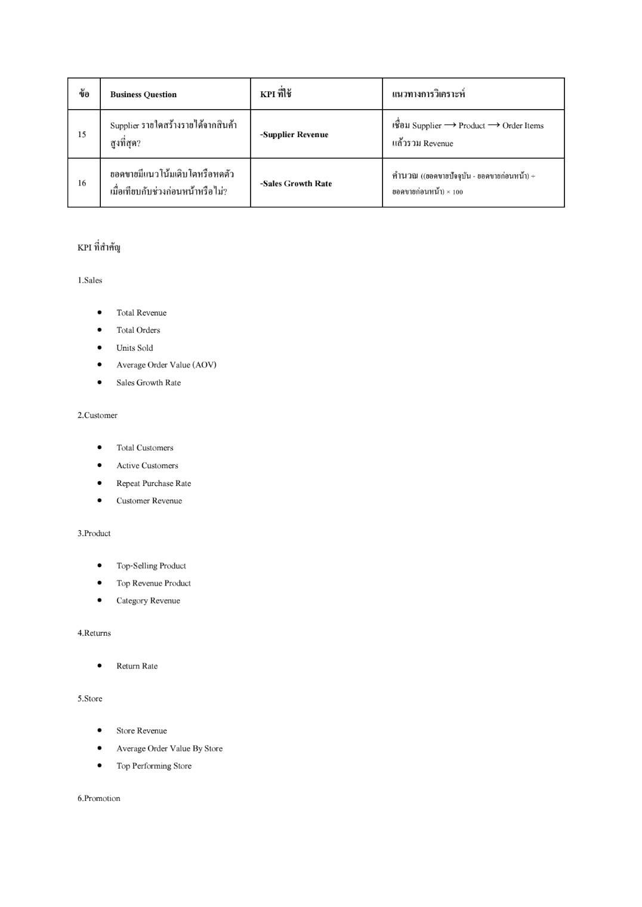
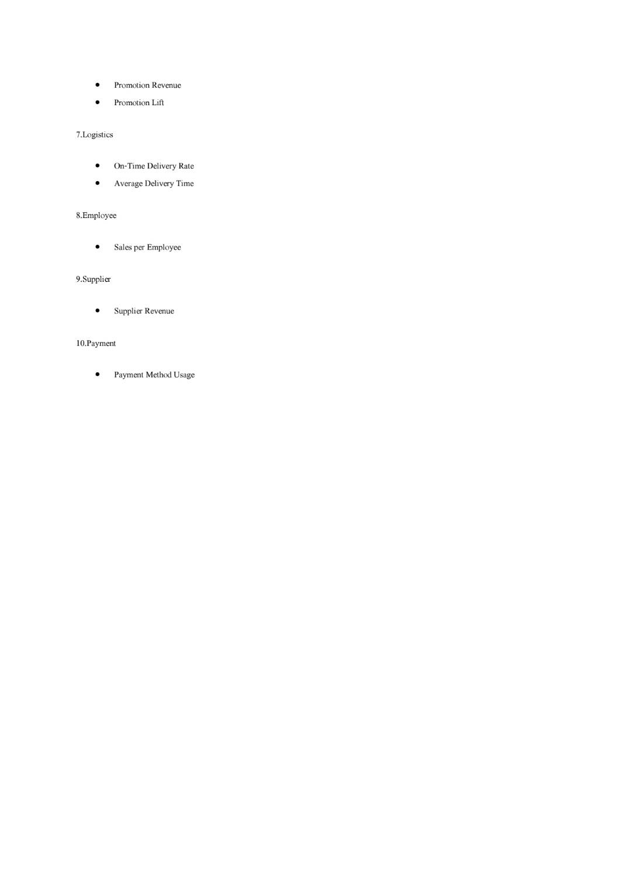
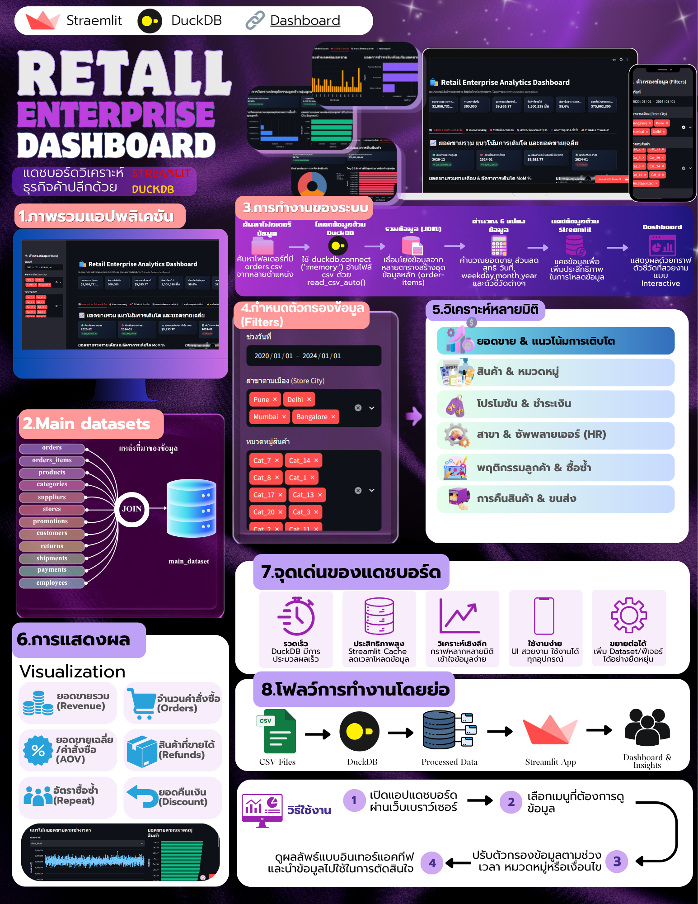

# Mini-Project
For Datawarehouse
# Presentation
https://canva.link/u97bsquxyowjw6u
### สมาชิก
1.นางสาวกนกวรรณ ทองเทพ รหัสนักศึกษา 673020243-5
   
2.นายณัฐวุฒิ กำจัดภัย รหัสนักศึกษา 673020251-6
   
3.นางสาวณิรดา อนุนิวัฒน์ รหัสนักศึกษา 673020252-4
   
4.นายภูธิป ต้นโลห์ รหัสนักศึกษา 673020261-3

5.นางสาวสุพิชชา คำสิงห์ รหัสนักศึกษา 673020265-5

6.นายสุวิชชา ผาสุข รหัสนักศึกษา 673020267-1

7.นายอพิชัย อิ่มวงค์ รหัสนักศึกษา 673020269-7

slide canva : https://canva.link/drif8b1apsznvjm

## การออกแบบและพัฒนาคลังข้อมูลเพื่อวิเคราะห์ข้อมูลการขายในธุรกิจค้าปลีก (Retail Analytics: From OLTP to OLAP Data Warehouse)

   มีวัตถุประสงค์เพื่อออกแบบและพัฒนาระบบคลังข้อมูลสำหรับธุรกิจค้าปลีก โดยนำข้อมูลจากฐานข้อมูลปฏิบัติการ (OLTP) มาผ่านกระบวนการ ETL/ELT เพื่อทำความสะอาดและแปลงข้อมูล จากนั้นจัดเก็บข้อมูลใน Data Warehouse ที่ออกแบบด้วยแนวคิด Dimensional Modeling และ Star Schema ประกอบด้วย Fact Table และ Dimension Tables เพื่อรองรับการวิเคราะห์ข้อมูลในมิติต่าง ๆ เช่น เวลา สินค้า ลูกค้า และสาขา ระบบจะนำข้อมูลจาก Data Warehouse มาวิเคราะห์ด้วยแนวคิด OLAP และพัฒนา Interactive Dashboard เพื่อแสดงยอดขาย จำนวนคำสั่งซื้อ กำไร สินค้าขายดี และตัวชี้วัดทางธุรกิจอื่น ๆ สำหรับสนับสนุนการตัดสินใจทางธุรกิจ

### 1. Dataset & Operational Database
ความหมายของ Dataset

1. Dataset คือชุดข้อมูลที่นำมาใช้ในการทำโครงงาน โดย Dataset นี้เป็นข้อมูลเกี่ยวกับ การขายสินค้าและการดำเนินงานของร้านค้าปลีก (Retail) ซึ่งประกอบด้วยข้อมูลลูกค้า สินค้า ร้านค้า คำสั่งซื้อ การชำระเงิน การจัดส่ง และการคืนสินค้า

2. Dataset นี้เป็นข้อมูลของ ระบบการขายสินค้าของธุรกิจค้าปลีก โดยจำลองกระบวนการตั้งแต่ลูกค้าเข้ามาสั่งซื้อสินค้า จนถึงการชำระเงิน การจัดส่ง และการคืนสินค้า
ตารางหลักของ Dataset

| ลำดับ	| 	ตาราง	 | จำนวน Records	| จำนวน Columns	| 	รายละเอียด 	|
|-------|------------|------------------|-------------------|---------------|
|   1	|  employees |	1,000		    |	   3	        |   ข้อมูลพนักงาน |


2	   returns 	    30,000	           3	          ข้อมูลการคืนสินค้า
3	   products	    10,000	           4	          ข้อมูลสินค้า
4	   suppliers	200 	           2	          ข้อมูลผู้จัดจำหน่าย
5	   categories	30	               2	          ข้อมูลประเภทสินค้า
6	   promotions	50  	           2	          ข้อมูลโปรโมชั่น
7	   stores	    100 	           2	          ข้อมูลสาขา
8	   customers	50,000	           3	          ข้อมูลลูกค้า
9	   payments 	300,000	           3	          ข้อมูลการชำระเงิน
10	   orders	    300,000	           5	          ข้อมูลคำสั่งซื้อ
11	   order_items	600,000	           5	          รายละเอียดสินค้าในคำสั่งซื้อ
12	   shipments	300,000	           3	          ข้อมูลการจัดส่ง

Dataset หลักทั้ง 12 ตารางมีข้อมูลรวมทั้งหมด 1,631,380 Records และ 39 Columns

https://colab.research.google.com/drive/1cb03m3na2yEKvnH9-JK1oxXGFHjB0PGo#scrollTo=b8417809

3. OLTP (Online Transaction Processing)

OLTP (Online Transaction Processing) หรือ ระบบประมวลผลรายการธุรกรรมออนไลน์ เป็นระบบฐานข้อมูลที่ใช้สำหรับจัดเก็บและประมวลผลธุรกรรมที่เกิดขึ้นจากการดำเนินงานประจำวันขององค์กร โดยมีจุดมุ่งหมายเพื่อให้สามารถบันทึก แก้ไข และเรียกใช้ข้อมูลธุรกรรมได้อย่างรวดเร็ว ถูกต้อง และเป็นระบบ รวมถึงสามารถรองรับธุรกรรมจำนวนมากและการทำงานของผู้ใช้งานหลายคนพร้อมกัน

สำหรับ Dataset ที่นำมาใช้ในโครงงานนี้ มีลักษณะเป็นข้อมูลของ ระบบธุรกิจค้าปลีก (Retail Business) ซึ่งประกอบด้วยข้อมูลลูกค้า สินค้า ร้านค้า พนักงาน ผู้จัดจำหน่าย ประเภทสินค้า โปรโมชั่น ตลอดจนข้อมูลการสั่งซื้อ การชำระเงิน การจัดส่ง และการคืนสินค้า โดย Dataset หลักประกอบด้วย 12 ตาราง จำนวนรวม 1,631,380 Records และ 39 Columns

จากการศึกษาลักษณะและโครงสร้างของข้อมูล พบว่า Dataset มีความสอดคล้องกับระบบ OLTP เนื่องจากมีทั้ง ข้อมูลหลัก (Master Data) และ ข้อมูลธุรกรรม (Transaction Data) ซึ่งทำงานเชื่อมโยงกันเพื่อรองรับกระบวนการขายสินค้า

3.1 ข้อมูลหลัก (Master Data)

ข้อมูลหลักเป็นข้อมูลที่ใช้ประกอบการทำธุรกรรมและไม่ได้เกิดขึ้นใหม่ทุกครั้งที่มีการซื้อสินค้า ประกอบด้วยตารางต่าง ๆ ดังนี้

-`customers     ใช้จัดเก็บข้อมูลลูกค้า      เช่น customer_id, city และ signup_date มีจำนวน 50,000 Records`
-`products      ใช้จัดเก็บข้อมูลสินค้า      เช่น product_id, category_id, supplier_id และ price มีจำนวน 10,000 Records`
-categories    ใช้จัดเก็บประเภทสินค้า         มีจำนวน 30 Records
-suppliers     ใช้จัดเก็บข้อมูลผู้จัดจำหน่าย     มีจำนวน 200 Records
-stores        ใช้จัดเก็บข้อมูลสาขา          มีจำนวน 100 Records
-employees     ใช้จัดเก็บข้อมูลพนักงาน        มีจำนวน 1,000 Records
-promotions    ใช้จัดเก็บข้อมูลโปรโมชั่น       มีจำนวน 50 Records

ข้อมูลเหล่านี้จะถูกนำมาใช้ประกอบการทำธุรกรรม เช่น เมื่อมีการสั่งซื้อสินค้า ระบบจะนำข้อมูลลูกค้า สินค้า สาขา และโปรโมชั่นที่เกี่ยวข้องมาเชื่อมโยงกับคำสั่งซื้อ

3.2 ข้อมูลธุรกรรม (Transaction Data)

ข้อมูลธุรกรรมเป็นข้อมูลที่เกิดขึ้นจากกิจกรรมต่าง ๆ ของระบบ โดยมีการเพิ่มข้อมูลเมื่อเกิดเหตุการณ์ใหม่ เช่น การสั่งซื้อ การชำระเงิน หรือการจัดส่ง ประกอบด้วย

orders ใช้บันทึกข้อมูลคำสั่งซื้อ ประกอบด้วย order_id, customer_id, store_id, order_date และ promotion_id มีจำนวน 300,000 Records
order_items ใช้บันทึกรายละเอียดสินค้าในแต่ละคำสั่งซื้อ ประกอบด้วย order_item_id, order_id, product_id, qty และ price มีจำนวน 600,000 Records
payments ใช้บันทึกข้อมูลการชำระเงิน ประกอบด้วย payment_id, order_id และ amount มีจำนวน 300,000 Records
shipments ใช้บันทึกข้อมูลการจัดส่ง ประกอบด้วย shipment_id, order_id และ status มีจำนวน 300,000 Records
returns ใช้บันทึกข้อมูลการคืนสินค้า ประกอบด้วย return_id, order_item_id และ refund มีจำนวน 30,000 Records

ตารางเหล่านี้มีความสำคัญต่อระบบ OLTP เนื่องจากเป็นข้อมูลที่เกิดขึ้นจากธุรกรรมโดยตรงและมีการบันทึกข้อมูลเป็นรายรายการ

3.3 กระบวนการทำงานของ OLTP ใน Dataset

การทำงานของระบบสามารถอธิบายเป็นกระบวนการตั้งแต่ลูกค้าทำการสั่งซื้อจนถึงการจัดส่งสินค้าได้ดังนี้

ขั้นตอนที่ 1 ลูกค้า

ลูกค้าถูกจัดเก็บในตาราง customers โดยมี customer_id เป็นรหัสสำหรับระบุลูกค้าแต่ละราย

↓

ขั้นตอนที่ 2 การสั่งซื้อสินค้า

เมื่อลูกค้าทำการสั่งซื้อ ระบบจะสร้างข้อมูลในตาราง orders โดยกำหนด order_id เพื่อระบุคำสั่งซื้อแต่ละรายการ และเชื่อมโยงกับ customer_id เพื่อระบุว่าคำสั่งซื้อเป็นของลูกค้ารายใด

↓

ขั้นตอนที่ 3 การบันทึกรายการสินค้า

รายละเอียดสินค้าที่อยู่ภายในคำสั่งซื้อจะถูกบันทึกใน order_items โดยใช้ order_id เชื่อมโยงกับคำสั่งซื้อ และใช้ product_id เชื่อมโยงกับข้อมูลสินค้าใน products

↓

ขั้นตอนที่ 4 การชำระเงิน

เมื่อมีการชำระเงิน ระบบจะบันทึกข้อมูลลงใน payments โดยใช้ order_id เพื่อระบุว่าการชำระเงินนั้นเกี่ยวข้องกับคำสั่งซื้อใด

↓

ขั้นตอนที่ 5 การจัดส่ง

เมื่อดำเนินการจัดส่ง ระบบจะสร้างข้อมูลใน shipments และใช้ status เพื่อระบุสถานะของการจัดส่ง

↓

ขั้นตอนที่ 6 การคืนสินค้า

หากลูกค้าต้องการคืนสินค้า ระบบจะบันทึกข้อมูลใน returns และใช้ order_item_id เพื่อระบุว่าสินค้าที่คืนเป็นรายการใดในคำสั่งซื้อ
ดังนั้น กระบวนการโดยรวมสามารถแสดงได้ดังนี้

Customer → Order → Order Item → Payment → Shipment → Return

3.4 ความสัมพันธ์ของข้อมูลที่สนับสนุนการทำงานแบบ OLTP

อีกหนึ่งลักษณะสำคัญของ Dataset คือการมีการเชื่อมโยงข้อมูลระหว่างตารางผ่านรหัสประจำข้อมูล เช่น

customer_id เชื่อมโยงข้อมูลลูกค้ากับคำสั่งซื้อ
order_id เชื่อมโยงคำสั่งซื้อกับรายละเอียดสินค้า การชำระเงิน และการจัดส่ง
product_id เชื่อมโยงรายการสินค้าเข้ากับข้อมูลสินค้า
category_id เชื่อมโยงสินค้าเข้ากับประเภทสินค้า
supplier_id เชื่อมโยงสินค้าเข้ากับผู้จัดจำหน่าย
store_id เชื่อมโยงคำสั่งซื้อและพนักงานกับสาขา
promotion_id เชื่อมโยงคำสั่งซื้อกับโปรโมชั่น
order_item_id เชื่อมโยงรายการสินค้าเข้ากับข้อมูลการคืนสินค้า

การแบ่งข้อมูลออกเป็นหลายตารางและเชื่อมโยงกันดังกล่าวช่วยลดการจัดเก็บข้อมูลซ้ำซ้อน และทำให้สามารถจัดการข้อมูลแต่ละส่วนได้อย่างเป็นระบบ

3.5 เหตุผลที่ Dataset มีลักษณะเป็น OLTP

จากการตรวจสอบ Dataset สามารถระบุเหตุผลที่สนับสนุนว่า Dataset นี้มีลักษณะเป็น OLTP ได้ดังนี้

ประการที่หนึ่ง Dataset มีตารางที่ใช้บันทึกธุรกรรมโดยตรง เช่น orders, order_items, payments, shipments และ returns

ประการที่สอง มีตารางข้อมูลหลัก เช่น customers, products, stores, categories, suppliers, employees และ promotions ซึ่งทำหน้าที่สนับสนุนการทำธุรกรรม

ประการที่สาม ข้อมูลมีรายละเอียดในระดับรายการธุรกรรม เช่น order_items สามารถระบุได้ว่าคำสั่งซื้อหนึ่งรายการประกอบด้วยสินค้าอะไร จำนวนเท่าใด และราคาเท่าใด

ประการที่สี่ Dataset มีจำนวนข้อมูลค่อนข้างมาก โดยมีข้อมูลรวม 1,631,380 Records ซึ่งส่วนใหญ่เป็นข้อมูลธุรกรรม เช่น order_items จำนวน 600,000 Records และ orders, payments และ shipments ตารางละ 300,000 Records

ประการที่ห้า ตารางต่าง ๆ มีการเชื่อมโยงข้อมูลด้วยรหัส เช่น order_id, customer_id และ product_id ซึ่งเป็นลักษณะสำคัญของฐานข้อมูลที่ใช้จัดการธุรกรรม

ประการที่หก โครงสร้างของ Dataset สามารถสะท้อนกระบวนการดำเนินงานของธุรกิจค้าปลีกตั้งแต่การสั่งซื้อ การบันทึกรายการสินค้า การชำระเงิน การจัดส่ง และการคืนสินค้า

3.6 สรุปการวิเคราะห์ OLTP

จากการวิเคราะห์ Dataset พบว่า Dataset มีลักษณะสอดคล้องกับ OLTP (Online Transaction Processing) เนื่องจากเป็นข้อมูลที่ใช้สนับสนุนกระบวนการดำเนินงานของธุรกิจค้าปลีก โดยมีทั้งข้อมูลหลักและข้อมูลธุรกรรมที่มีการเชื่อมโยงกันอย่างเป็นระบบ

ข้อมูลธุรกรรมที่สำคัญ ได้แก่ orders, order_items, payments, shipments และ returns ซึ่งทำหน้าที่บันทึกเหตุการณ์ต่าง ๆ ที่เกิดขึ้นจากการดำเนินงาน ขณะที่ customers, products, categories, suppliers, stores, employees และ promotions ทำหน้าที่เป็นข้อมูลหลักที่ใช้ประกอบการทำธุรกรรม

นอกจากนี้ Dataset ยังมีการเชื่อมโยงข้อมูลผ่านรหัสต่าง ๆ เช่น customer_id, order_id, product_id และ store_id ทำให้สามารถติดตามข้อมูลของธุรกรรมตั้งแต่การสั่งซื้อจนถึงการชำระเงิน การจัดส่ง และการคืนสินค้าได้

ดังนั้น Dataset นี้สามารถจัดอยู่ในลักษณะของฐานข้อมูล OLTP สำหรับระบบค้าปลีก เนื่องจากมีโครงสร้างที่มุ่งเน้นการจัดเก็บข้อมูลธุรกรรมที่เกิดขึ้นในแต่ละวัน มีข้อมูลในระดับรายละเอียดของ Transaction และมีความสัมพันธ์ระหว่างข้อมูลหลายตารางเพื่อสนับสนุนกระบวนการทำงานของระบบค้าปลีกอย่างเป็นระบบและมีประสิทธิภาพ


## 2. ER Diagram (หลิน) 


## Database Relationships

| Table | Relationship | Table |
|---|:---:|---|
| categories | 1:N | products |
| suppliers | 1:N | products |
| products | 1:N | order_items |
| orders | 1:N | order_items |
| order_items | 1:N | returns |
| customers | 1:N | orders |
| stores | 1:N | orders |
| promotions | 1:N | orders |
| orders | 1:N | payments |
| orders | 1:N | shipments |
| stores | 1:N | employees |

## 3.Business Questions (ฟีฟ่า)




## 4.Business Process and Multidimensional Data Model

### 4.1 Business Process

จากการวิเคราะห์ระบบขายปลีก พบว่าข้อมูลสามารถแบ่งออกเป็นกระบวนการทางธุรกิจหลักที่เกี่ยวข้องกับการวิเคราะห์ใน Dashboard ดังนี้

#### 1. Sales Process

กระบวนการขายสินค้าเป็น Business Process หลักของระบบ โดยใช้ข้อมูลจาก `Orders` และ `Order Items` เพื่อวิเคราะห์ยอดขาย จำนวนสินค้าที่ขาย รายได้ตามสินค้า หมวดหมู่ ลูกค้า ร้านค้า โปรโมชั่น และซัพพลายเออร์

ข้อมูลหลักที่เกี่ยวข้อง:
- `Orders`
- `Order Items`
- `Products`
- `Categories`
- `Customers`
- `Stores`
- `Promotions`
- `Suppliers`

ตัวชี้วัดสำคัญ:
- Total Sales / Revenue
- Monthly Revenue
- Product Revenue
- Units Sold
- Category Revenue
- Store Revenue
- Customer Revenue
- Average Order Value (AOV)
- Sales Growth Rate
- Promotion Revenue
- Supplier Revenue

Grain ของ Sales Process:

> 1 แถวใน Fact_Sales แทนสินค้า 1 รายการใน 1 Order Line Item (One Order Line Item)


#### 2. Return Process

กระบวนการคืนสินค้าใช้ข้อมูลจาก `Returns` ซึ่งเชื่อมโยงกับ `Order Items` เพื่อวิเคราะห์จำนวนและมูลค่าการคืนสินค้า รวมถึงใช้เปรียบเทียบกับยอดขายเพื่อคำนวณ Return Rate

ข้อมูลหลักที่เกี่ยวข้อง:
- `Returns`
- `Order Items`
- `Orders`
- `Products`
- `Customers`
- `Stores`

ตัวชี้วัดสำคัญ:
- Returned Quantity
- Refund Amount
- Return Rate

Grain ของ Return Process:

> 1 แถวใน Fact_Returns แทน 1 รายการการคืนสินค้า (One Return Transaction)

หมายเหตุ: ตาราง `Returns` ในระบบไม่มีข้อมูลสาเหตุการคืนสินค้า (`return_reason`) ดังนั้นไม่สามารถวิเคราะห์ Return Rate by Reason ได้จากข้อมูลปัจจุบัน


#### 3. Shipment Process

กระบวนการจัดส่งสินค้าใช้ข้อมูลจาก `Shipments` ซึ่งเชื่อมโยงกับ `Orders` เพื่อวิเคราะห์สถานะของการจัดส่งสินค้า

ข้อมูลหลักที่เกี่ยวข้อง:
- `Shipments`
- `Orders`
- `Customers`
- `Stores`

ตัวชี้วัด/ข้อมูลที่สามารถวิเคราะห์ได้:
- Shipment Status
- จำนวน Shipment ตามสถานะ
- สัดส่วน Shipment ตามสถานะ

Grain ของ Shipment Process:

> 1 แถวใน Fact_Shipments แทน 1 รายการจัดส่งสินค้า (One Shipment)

หมายเหตุ: ตาราง `Shipments` มีเพียง `shipment_id`, `order_id` และ `status` ไม่มีข้อมูลวันที่คาดว่าจะจัดส่งหรือวันที่จัดส่งจริง ดังนั้นจึงไม่สามารถคำนวณ On-Time Delivery Rate หรือ Average Delivery Time ได้จากข้อมูลปัจจุบัน


#### 4. Payment Process

กระบวนการชำระเงินใช้ข้อมูลจาก `Payments` ซึ่งเชื่อมโยงกับ `Orders` เพื่อวิเคราะห์จำนวนเงินที่ชำระในแต่ละรายการ

ข้อมูลหลักที่เกี่ยวข้อง:
- `Payments`
- `Orders`

ตัวชี้วัดสำคัญ:
- Payment Amount
- Number of Payment Transactions

Grain ของ Payment Process:

> 1 แถวใน Fact_Payments แทน 1 รายการธุรกรรมการชำระเงิน (One Payment Transaction)

หมายเหตุ: ตาราง `Payments` ไม่มีข้อมูล `payment_method` ดังนั้นไม่สามารถวิเคราะห์ Payment Method Usage ตามประเภทวิธีการชำระเงินได้จากข้อมูลปัจจุบัน.


---

### 4.2 Multidimensional Data Model

จาก Business Process ที่วิเคราะห์ สามารถออกแบบ Multidimensional Data Model โดยแบ่งข้อมูลออกเป็น Fact Tables และ Dimension Tables เพื่อรองรับการวิเคราะห์ข้อมูลใน Dashboard

#### Fact Tables

ระบบประกอบด้วย Fact Tables หลัก 4 ตาราง ได้แก่

##### 1.Fact_Sales

ใช้เก็บข้อมูลเชิงตัวเลขที่เกี่ยวข้องกับการขายสินค้า

**Grain:**
> 1 แถว = 1 สินค้าใน 1 Order Line Item

**Foreign Keys:**
- `date_id`
- `product_id`
- `customer_id`
- `store_id`
- `promotion_id`
- `supplier_id`

**Degenerate/Reference Keys:**
- `order_id`
- `order_item_id`

**Measures:**
- `quantity` — จำนวนสินค้าที่ขาย
- `unit_price` — ราคาต่อหน่วย
- `sales_amount` — มูลค่าการขาย
- `discount` — ส่วนลด

Calculated Measures:
- `Average Selling Price = Sales Amount / Quantity`
- `Sales Growth Rate`
- `Average Order Value (AOV)`
- `Profit Margin` หากมีข้อมูลต้นทุน/กำไรเพิ่มเติมในข้อมูลต้นทาง


##### 2. Fact_Returns

ใช้เก็บข้อมูลการคืนสินค้า

**Grain:**
> 1 แถว = 1 Return Transaction

**Foreign Keys:**
- `product_id`
- `customer_id`
- `store_id`

**Reference Keys:**
- `return_id`
- `order_item_id`

**Measures:**
- `refund` — จำนวนเงินคืนสินค้า
- `returned_quantity` หากสามารถคำนวณหรือมีข้อมูลจำนวนสินค้าที่คืนจากข้อมูลต้นทาง

Calculated Measure:
- `Return Rate = Returned Quantity / Sold Quantity × 100`

หมายเหตุ: ตาราง `Returns` มีเพียง `return_id`, `order_item_id` และ `refund` จึงไม่มีข้อมูล `return_reason` และไม่มีวันที่คืนสินค้าโดยตรง


##### 3. Fact_Shipments

ใช้เก็บข้อมูลการจัดส่งสินค้า

**Grain:**
> 1 แถว = 1 Shipment

**Foreign Keys / Reference Keys:**
- `order_id`
- `customer_id`
- `store_id`

**Measures / Attributes:**
- `status` — สถานะการจัดส่ง

เนื่องจากข้อมูลต้นทางไม่มีวันที่จัดส่งหรือวันที่คาดว่าจะจัดส่ง จึงไม่สามารถคำนวณ Delivery Lead Time และ On-Time Delivery Rate ได้


##### 4. Fact_Payments

ใช้เก็บข้อมูลธุรกรรมการชำระเงิน

**Grain:**
> 1 แถว = 1 Payment Transaction

**Reference Keys:**
- `payment_id`
- `order_id`

**Measure:**
- `amount` — จำนวนเงินที่ชำระ

หมายเหตุ: ไม่มี `payment_method` ในตาราง Payments ดังนั้นไม่สามารถวิเคราะห์การใช้งานวิธีการชำระเงินแต่ละประเภทได้

---

### 4.3 Dimension Tables

#### Dim_Date

ใช้สำหรับวิเคราะห์ข้อมูลตามช่วงเวลา

**Primary Key:**
- `date_id`

**Attributes:**
- `day`
- `month`
- `quarter`
- `year`

Hierarchy:

> Year → Quarter → Month → Day

ใช้สำหรับการวิเคราะห์:
- Daily Sales
- Monthly Revenue
- Quarterly Revenue
- Yearly Revenue
- Sales Growth Rate


#### Dim_Product

ใช้สำหรับวิเคราะห์ข้อมูลตามสินค้าและหมวดหมู่สินค้า

**Primary Key:**
- `product_id`

**Attributes:**
- `category_id`
- `category_name`
- `supplier_id`
- `price`

โดยข้อมูล `category_name` มาจากตาราง `Categories` และนำมารวมไว้ใน Dim_Product เพื่อให้โครงสร้างสามารถรองรับ Star Schema ได้โดยไม่ต้องเชื่อมต่อ Dimension ผ่าน Dimension อีกชั้นหนึ่ง


#### Dim_Customer

ใช้สำหรับวิเคราะห์พฤติกรรมและรายได้ของลูกค้า

**Primary Key:**
- `customer_id`

**Attributes:**
- `city`
- `signup_date`


#### Dim_Store

ใช้สำหรับวิเคราะห์ผลการดำเนินงานของแต่ละสาขา

**Primary Key:**
- `store_id`

**Attributes:**
- `city`

Hierarchy:

> Store → City


#### Dim_Promotion

ใช้สำหรับวิเคราะห์ผลของโปรโมชั่นต่อยอดขาย

**Primary Key:**
- `promotion_id`

**Attributes:**
- `discount`

ใช้ในการวิเคราะห์:
- Promotion Revenue
- Promotion Performance
- Promotion Lift


#### Dim_Supplier

ใช้สำหรับวิเคราะห์ข้อมูลของ Supplier

**Primary Key:**
- `supplier_id`

**Attributes:**
- `country`

ใช้ในการวิเคราะห์ Supplier Revenue


#### Dim_Employee

ใช้สำหรับวิเคราะห์ข้อมูลพนักงานและความสัมพันธ์กับสาขา

**Primary Key:**
- `employee_id`

**Attributes:**
- `store_id`
- `salary`

หมายเหตุ: ใน ER Diagram พนักงานเชื่อมโยงกับ Store แต่ไม่มีความสัมพันธ์โดยตรงกับ Orders ดังนั้นไม่สามารถใช้ข้อมูลนี้เพื่อคำนวณ Sales per Employee ได้โดยตรง

### 4.3 Measures and Measure Types

Measures คือค่าตัวเลขที่ใช้ในการวิเคราะห์ข้อมูลใน Fact Tables โดยสามารถแบ่งตามลักษณะการนำไปคำนวณรวมได้เป็น Additive, Semi-Additive และ Non-Additive Measures

#### 1. Fact_Sales Measures

| Measure | Description | Measure Type |
|---|---|---|
| `quantity` | จำนวนสินค้าที่ขายในแต่ละ Order Line Item | Additive |
| `sales_amount` | มูลค่าการขายสินค้า | Additive |
| `unit_price` | ราคาขายต่อหน่วย | Non-Additive |
| `discount` | มูลค่าส่วนลดจาก Promotion | Additive |

Calculated Measures:

| Calculated Measure | Formula | Measure Type |
|---|---|---|
| `Total Sales` | SUM(sales_amount) | Additive |
| `Units Sold` | SUM(quantity) | Additive |
| `Average Selling Price` | SUM(sales_amount) / SUM(quantity) | Non-Additive |
| `Average Order Value (AOV)` | SUM(sales_amount) / COUNT(DISTINCT order_id) | Non-Additive |
| `Sales Growth Rate` | ((Current Sales - Previous Sales) / Previous Sales) × 100 | Non-Additive |
| `Promotion Revenue` | SUM(sales_amount) GROUP BY promotion_id | Additive |
| `Supplier Revenue` | SUM(sales_amount) GROUP BY supplier_id | Additive |


#### 2. Fact_Returns Measures

| Measure | Description | Measure Type |
|---|---|---|
| `refund` | จำนวนเงินที่คืนให้ลูกค้า | Additive |

Calculated Measures:

| Calculated Measure | Formula | Measure Type |
|---|---|---|
| `Total Refund` | SUM(refund) | Additive |
| `Return Rate` | Returned Transactions / Total Sales Transactions × 100 | Non-Additive |

หมายเหตุ: เนื่องจากตาราง `Returns` ไม่มี `returned_quantity` จึงไม่สามารถคำนวณ Return Rate จากจำนวนชิ้นสินค้าได้โดยตรง หากต้องการคำนวณ Return Rate ตามจำนวนสินค้า จำเป็นต้องมีข้อมูลจำนวนสินค้าที่คืนเพิ่มเติม


#### 3. Fact_Shipments Measures

| Measure | Description | Measure Type |
|---|---|---|
| `shipment_count` | จำนวนรายการจัดส่ง | Additive |

Calculated Measures:

| Calculated Measure | Formula | Measure Type |
|---|---|---|
| `Shipment Count` | COUNT(shipment_id) | Additive |
| `Shipment Status Rate` | Shipment Count by Status / Total Shipment Count × 100 | Non-Additive |

หมายเหตุ: ตาราง `Shipments` มีเพียง `shipment_id`, `order_id` และ `status` จึงสามารถวิเคราะห์จำนวนและสัดส่วนตามสถานะได้ แต่ไม่สามารถคำนวณ Delivery Lead Time หรือ On-Time Delivery Rate ได้


#### 4. Fact_Payments Measures

| Measure | Description | Measure Type |
|---|---|---|
| `amount` | จำนวนเงินที่ชำระ | Additive |

Calculated Measures:

| Calculated Measure | Formula | Measure Type |
|---|---|---|
| `Total Payment Amount` | SUM(amount) | Additive |
| `Payment Transaction Count` | COUNT(payment_id) | Additive |

หมายเหตุ: ตาราง `Payments` ไม่มี `payment_method` จึงไม่สามารถวิเคราะห์ Payment Method Usage ตามประเภทวิธีการชำระเงินได้

---

### 4.5 Summary of Fact and Dimension Tables

#### Fact Tables

| Table | Grain / Purpose | Base Measures | Measure Type | Calculated Measures |
|---|---|---|---|---|
| `Fact_Sales` | 1 Order Line Item | `quantity`, `sales_amount`, `discount`, `unit_price` | Additive: `quantity`, `sales_amount`, `discount` / Non-Additive: `unit_price` | `Average Selling Price`, `AOV`, `Sales Growth Rate`, `Promotion Revenue`, `Supplier Revenue` |
| `Fact_Returns` | 1 Return Transaction | `refund` | Additive | `Total Refund`, `Return Rate*` |
| `Fact_Shipments` | 1 Shipment | `shipment_count` | Additive | `Shipment Status Rate` |
| `Fact_Payments` | 1 Payment Transaction | `amount` | Additive | `Total Payment Amount`, `Payment Transaction Count` |


#### Dimension Tables

| Table | Type | Primary Key | Main Attributes | Purpose |
|---|---|---|---|---|
| `Dim_Date` | Dimension | `date_id` | `day`, `month`, `quarter`, `year` | วิเคราะห์ข้อมูลตามช่วงเวลา |
| `Dim_Product` | Dimension | `product_id` | `category_id`, `category_name`, `supplier_id`, `price` | วิเคราะห์สินค้าและหมวดหมู่ |
| `Dim_Customer` | Dimension | `customer_id` | `city`, `signup_date` | วิเคราะห์ลูกค้าและพฤติกรรมการซื้อ |
| `Dim_Store` | Dimension | `store_id` | `city` | วิเคราะห์ยอดขายตามสาขา |
| `Dim_Promotion` | Dimension | `promotion_id` | `discount` | วิเคราะห์ประสิทธิภาพของ Promotion |
| `Dim_Supplier` | Dimension | `supplier_id` | `country` | วิเคราะห์ Supplier และรายได้จากสินค้า |
| `Dim_Employee` | Dimension | `employee_id` | `store_id`, `salary` | วิเคราะห์ข้อมูลพนักงานและสาขา |


---

### 4.6 Overall Multidimensional Model

Multidimensional Data Model ของระบบประกอบด้วยหลาย Fact Tables ที่ใช้ Dimension ร่วมกัน โดย `Fact_Sales` เป็น Fact หลักสำหรับการวิเคราะห์ยอดขาย และมี `Fact_Returns`, `Fact_Shipments` และ `Fact_Payments` สำหรับรองรับกระบวนการคืนสินค้า การจัดส่ง และการชำระเงินตามลำดับ

Dimension ที่สามารถใช้ร่วมกันระหว่างหลาย Fact Tables ได้แก่ `Dim_Date`, `Dim_Product`, `Dim_Customer` และ `Dim_Store` ซึ่งช่วยให้สามารถวิเคราะห์ข้อมูลจากหลาย Business Processes ในมุมมองเดียวกัน

โครงสร้างโดยรวมสามารถอธิบายได้ว่าเป็น **Fact Constellation / Galaxy Schema** ซึ่งประกอบด้วยหลาย Star Schemas ที่ใช้ Conformed Dimensions ร่วมกัน

```text
                         Dim_Date
                       /     |      \
                      /      |       \
                     ▼       ▼        ▼
              Fact_Sales  Fact_Returns  Fact_Shipments
                  │           │             │
             Dimensions   Dimensions    Dimensions
                  │
                  ▼
             Fact_Payments

```

### Data Model Diagram (Star Scheme) แซนด์วิช


## การดำเนินงานด้านการจัดการข้อมูลด้วยกระบวนการ ELT

## 1. กระบวนการ ELT (ELT Process)

1.1 หลักการและแนวคิดของ ELT

โครงงานนี้ใช้กระบวนการ ELT (Extract, Load, Transform) ในการจัดการข้อมูล โดยมีวัตถุประสงค์เพื่อรวบรวมข้อมูลจากระบบต้นทาง จัดเก็บข้อมูลในฐานข้อมูล และดำเนินการทำความสะอาดและแปลงข้อมูลภายหลังจากที่ข้อมูลถูก Load เข้าสู่ฐานข้อมูลแล้ว

ELT ประกอบด้วย 3 ขั้นตอนหลัก ได้แก่

Extract – การดึงข้อมูลจากแหล่งข้อมูลต้นทาง
Load – การนำข้อมูลเข้าสู่ฐานข้อมูลในรูปแบบ Raw/Staging
Transform – การทำความสะอาด แปลง และจัดโครงสร้างข้อมูลเพื่อเตรียมเข้าสู่ Data Warehouse

| ขั้นตอน (Stage) | ชื่อชั้นข้อมูล (Layer Name) | เครื่องมือ / เทคโนโลยี (Tools) | หน้าที่และการทำงาน (Function / Tasks) |
| :--- | :--- | :--- | :--- |
| **1. Source** | **แหล่งข้อมูลต้นทาง** | Google Drive / CSV Files | จัดเก็บไฟล์ข้อมูลดิบรูปแบบ CSV บน Google Drive พร้อมสำหรับการดึงไปใช้งาน |
| **2. Extract** | **Raw / Staging** | DuckDB | ทำการดึงข้อมูลดิบ (Extract) เข้าสู่พื้นที่พักข้อมูล (Staging Area) เพื่อเตรียมนำไปแปลงสภาพ |
| **3. Transform** | **Transform Layer** | Data Processing Engine | ทำการทำความสะอาดข้อมูล (Cleaning), เชื่อมโยงข้อมูล (Join), แปลงชนิดข้อมูล (Type Conversion) และคำนวณค่าต่างๆ (Calculation) |
| **4. Storage** | **Data Warehouse** | Relational / Analytical DB | จัดเก็บข้อมูลที่ผ่านการแปลงแล้วลงในรูปแบบ **Fact Tables** (ตารางข้อเท็จจริง) และ **Dimension Tables** (ตารางมิติ) |
| **5. Output** | **Analysis** | BI Tools / Dashboards / SQL | นำข้อมูลที่จัดเก็บใน Data Warehouse ไปวิเคราะห์ ทำรายงาน หรือนำเสนอต่อผู้ใช้งาน |

## 1.2 โครงสร้าง Dataset

Dataset ที่ใช้ในโครงงานเป็นข้อมูลระบบค้าปลีก ประกอบด้วยข้อมูลเกี่ยวกับลูกค้า สินค้า ร้านค้า คำสั่งซื้อ การชำระเงิน การจัดส่ง การคืนสินค้า โปรโมชั่น และข้อมูลที่เกี่ยวข้องกับการดำเนินงานของธุรกิจค้าปลีก

จากการตรวจสอบข้อมูลพบ 12 ตารางหลัก ดังนี้
นอกจากนี้ยังพบไฟล์ข้อมูลประเภท TXT และ ZIP ซึ่งเป็นข้อมูลตัวอย่างขนาดเล็ก จึงแยกออกจาก Dataset หลักเพื่อให้การวิเคราะห์โครงสร้างฐานข้อมูลค้าปลีกมีความชัดเจน

| ลำดับ | ตาราง | Records | Columns | ประเภทข้อมูล |
| :---: | :--- | :---: | :---: | :---: |
| 1 | employees | 1,000 | 3 | Master |
| 2 | returns | 30,000 | 3 | Transaction |
| 3 | products | 10,000 | 4 | Master |
| 4 | suppliers | 200 | 2 | Master |
| 5 | categories | 30 | 2 | Master |
| 6 | promotions | 50 | 2 | Master |
| 7 | stores | 100 | 2 | Master |
| 8 | customers | 50,000 | 3 | Master |
| 9 | payments | 300,000 | 3 | Transaction |
| 10 | orders | 300,000 | 5 | Transaction |
| 11 | order_items | 600,000 | 5 | Transaction |
| 12 | shipments | 300,000 | 3 | Transaction |

รวมข้อมูลทั้งหมด
<1,591,380 Records และ 39 Columns>

# 2 ELT Process

2.5 ELT Data Flow

กระบวนการ ELT (Extract, Load, Transform) ของระบบ Retail Data Warehouse มีวัตถุประสงค์เพื่อรวบรวมข้อมูลจากแหล่งข้อมูลต้นทางให้อยู่ในรูปแบบที่เหมาะสมสำหรับการวิเคราะห์ข้อมูลเชิงธุรกิจ โดยระบบรับข้อมูลต้นทางในรูปแบบ CSV จำนวน 12 ตาราง และนำข้อมูลเข้าสู่ DuckDB เพื่อจัดเก็บและประมวลผล

กระบวนการทำงานแบ่งออกเป็น 4 Layers ได้แก่

Source Layer — ข้อมูลต้นทางจากไฟล์ CSV
Staging Layer — ข้อมูลที่ Load เข้าสู่ DuckDB
Transform Layer — การทำความสะอาดและแปลงข้อมูลด้วย dbt + DuckDB
Data Warehouse Layer — ข้อมูลที่ถูกจัดโครงสร้างเป็น Dimension และ Fact Tables สำหรับการวิเคราะห์

```
┌─────────────────────────────────────────────┐
│                SOURCE LAYER                 │
│                                             │
│              12 CSV Tables                  │
│                                             │
│ employees   returns      products            │
│ suppliers   categories  promotions          │
│ stores      customers   payments            │
│ orders      order_items shipments           │
└──────────────────────┬──────────────────────┘
                       │
                       │ Extract
                       │ Python + Pandas
                       ▼
┌─────────────────────────────────────────────┐
│              STAGING LAYER                  │
│                                             │
│                DuckDB                      │
│                                             │
│              12 stg_* Tables                │
└──────────────────────┬──────────────────────┘
                       │
                       │ Transform
                       │ dbt + DuckDB
                       ▼
┌─────────────────────────────────────────────┐
│             TRANSFORM LAYER                 │
│                                             │
│ Data Cleaning                               │
│ Data Type Conversion                        │
│ Primary Key / Foreign Key Validation        │
│ JOIN Related Tables                         │
│ Business Calculation                        │
└──────────────────────┬──────────────────────┘
                       │
                       ▼
┌─────────────────────────────────────────────┐
│          DATA WAREHOUSE LAYER               │
│                                             │
│ Dimensions — 7 Tables                      │
│ Facts — 4 Tables                            │
│                                             │
│ Multiple Star Schema /                     │
│ Fact Constellation Schema                   │
└─────────────────────────────────────────────┘
```

1.1 Extract — การดึงข้อมูลจาก Source

ขั้นตอน Extract เป็นการนำข้อมูลจากไฟล์ Source Data ซึ่งอยู่ในรูปแบบ CSV เข้าสู่กระบวนการ Data Warehouse โดยโครงการมีข้อมูลต้นทางทั้งหมด 12 ตาราง ได้แก่ Employees, Returns, Products, Suppliers, Categories, Promotions, Stores, Customers, Payments, Orders, Order Items และ Shipments

ในขั้นตอนนี้ข้อมูลจะถูกอ่านและตรวจสอบเบื้องต้น เช่น จำนวน Records และจำนวน Columns ของแต่ละตาราง เพื่อยืนยันว่าข้อมูลสามารถนำเข้าสู่กระบวนการ ELT ได้อย่างครบถ้วน

ผลลัพธ์ที่ได้:
ได้ข้อมูล Source Data ทั้ง 12 ตารางที่พร้อมสำหรับนำเข้าสู่ Staging Layer

1.2 Load — การนำข้อมูลเข้าสู่ Staging Layer

หลังจากดึงข้อมูลจาก Source แล้ว ข้อมูลทั้งหมดจะถูกนำเข้าสู่ฐานข้อมูล DuckDB โดยจัดเก็บเป็น Staging Tables และตั้งชื่อในรูปแบบ stg_<table_name> เช่น stg_orders, stg_products และ stg_customers

Staging Layer มีหน้าที่เป็นพื้นที่พักข้อมูลต้นทางก่อนเข้าสู่กระบวนการ Transformation โดยยังคงโครงสร้างข้อมูลจาก Source เพื่อให้ง่ายต่อการตรวจสอบและนำไปใช้งานในขั้นตอนถัดไป

ผลลัพธ์ที่ได้:
ได้ Staging Tables จำนวน 12 ตารางภายใน DuckDB ซึ่งพร้อมสำหรับการทำความสะอาด ตรวจสอบ และ Transformation

1.3 Transformation — การแปลงข้อมูล

ขั้นตอน Transformation เป็นการนำข้อมูลจาก Staging Layer มาปรับโครงสร้างให้เหมาะสมกับ Data Warehouse โดยใช้ dbt ร่วมกับ DuckDB ในการจัดการ SQL Transformation

ข้อมูลจะถูกนำมาคัดเลือก Columns ที่จำเป็น รวมถึงเชื่อมโยงข้อมูลระหว่างตารางที่มีความสัมพันธ์กัน เพื่อสร้าง Dimension Tables และ Fact Tables ตามโครงสร้างของ Data Model

1.3.1 Dimension Tables

ในโครงการนี้มี Dimension Tables ทั้งหมด 7 ตาราง ได้แก่

Dim_Date — ใช้สำหรับวิเคราะห์ข้อมูลตามวัน เดือน ไตรมาส และปี
Dim_Product — เก็บข้อมูลสินค้า Category, Supplier และราคา
Dim_Customer — เก็บข้อมูลลูกค้า เมือง และวันที่สมัครสมาชิก
Dim_Store — เก็บข้อมูลสาขาและพื้นที่ของสาขา
Dim_Promotion — เก็บข้อมูล Promotion และ Discount
Dim_Supplier — เก็บข้อมูล Supplier และประเทศ
Dim_Employee — เก็บข้อมูลพนักงาน Store และ Salary

Dim_Employee ถูกจัดเก็บไว้ใน Data Warehouse เพื่อรักษาข้อมูลจาก Source Data อย่างไรก็ตาม เนื่องจากข้อมูล Employee จาก Source ไม่มีความสัมพันธ์โดยตรงกับ Order หรือ Fact Tables ที่กำหนดไว้ จึงไม่ได้แสดง Dim_Employee ใน Star Schema หลัก และไม่มีการสร้าง Relationship เพิ่มเติมที่ไม่มีอยู่ในข้อมูลต้นทาง

ผลลัพธ์ที่ได้:
ได้ Dimension Tables จำนวน 7 ตาราง ซึ่งทำหน้าที่เป็นข้อมูลอธิบายสำหรับใช้ประกอบการวิเคราะห์ข้อมูลใน Fact Tables

1.3.2 Fact Tables

ในโครงการนี้กำหนด Fact Tables ทั้งหมด 4 ตาราง ได้แก่

Fact_Sales

เก็บข้อมูลการขาย โดยกำหนด Grain เป็น 1 Order Line Item ต่อ 1 Record ประกอบด้วยข้อมูลจำนวนสินค้า ราคาต่อหน่วย ยอดขาย Discount และ Foreign Keys ที่เชื่อมไปยัง Dimension Tables ที่เกี่ยวข้อง

ยอดขายสามารถคำนวณจากจำนวนสินค้าที่ขายคูณด้วยราคาต่อหน่วย

ผลลัพธ์ที่ได้:
สามารถนำไปวิเคราะห์ยอดขาย จำนวนสินค้าที่ขาย ราคาขาย และยอดขายตาม Product, Customer, Store, Promotion, Supplier และช่วงเวลาได้

Fact_Return

เก็บข้อมูลการคืนสินค้า โดยกำหนด Grain เป็น 1 Return Transaction ต่อ 1 Record และเชื่อมข้อมูล Return กับ Order Item และ Order เพื่อระบุสินค้า ลูกค้า และ Store ที่เกี่ยวข้อง

ผลลัพธ์ที่ได้:
สามารถวิเคราะห์จำนวนการคืนสินค้าและมูลค่า Refund รวมถึงเปรียบเทียบการคืนสินค้าตาม Product, Customer และ Store ได้

Fact_Shipments

เก็บข้อมูลการจัดส่ง โดยกำหนด Grain เป็น 1 Shipment ต่อ 1 Record และเชื่อมกับ Order เพื่อระบุ Customer และ Store ที่เกี่ยวข้อง

ผลลัพธ์ที่ได้:
สามารถวิเคราะห์จำนวน Shipment และสถานะของการจัดส่งได้

Fact_Payments

เก็บข้อมูลการชำระเงิน โดยกำหนด Grain เป็น 1 Payment Transaction ต่อ 1 Record และเชื่อมกับ Order เพื่อระบุ Customer และ Store ที่เกี่ยวข้อง

ผลลัพธ์ที่ได้:
สามารถวิเคราะห์ยอดเงินที่ชำระและจำนวนรายการชำระเงิน รวมถึงวิเคราะห์ตาม Customer, Store และช่วงเวลาที่เกี่ยวข้องได้

1.4 Data Cleaning & Validation

หลังจากนำข้อมูลเข้าสู่ Staging Layer จะมีการตรวจสอบและทำความสะอาดข้อมูลก่อนนำไปสร้าง Data Warehouse โดยตรวจสอบข้อมูลสำคัญ ได้แก่

Missing Values ตรวจสอบค่าที่หายไปในแต่ละตาราง
Duplicate Records ตรวจสอบข้อมูลที่ซ้ำกัน
Primary Key ตรวจสอบว่าค่า Primary Key มีความเป็น Unique
Foreign Key ตรวจสอบความถูกต้องของความสัมพันธ์ระหว่างตาราง
Data Type ตรวจสอบและปรับชนิดข้อมูลให้เหมาะสม
Date Data ตรวจสอบข้อมูลวันที่และนำไปสร้าง date_id
Calculated Measures ตรวจสอบการคำนวณค่าที่เกิดจากการ Transformation เช่น sales_amount

ผลลัพธ์ที่ได้:
ข้อมูลมีความถูกต้องและมีความสอดคล้องมากขึ้นก่อนนำเข้าสู่ Final Data Warehouse และช่วยลดปัญหาที่อาจเกิดขึ้นระหว่างการวิเคราะห์ข้อมูล

1.5 Final Data Warehouse Validation

หลังจาก Transformation และ Data Cleaning เสร็จสิ้น จะมีการตรวจสอบ Final Data Warehouse เพื่อยืนยันว่าตารางที่กำหนดไว้ถูกสร้างขึ้นครบถ้วนและสามารถนำไปใช้งานได้

Final Data Warehouse ประกอบด้วยทั้งหมด 11 ตาราง แบ่งเป็น

Dimension Tables จำนวน 7 ตาราง

Dim_Date
Dim_Product
Dim_Customer
Dim_Store
Dim_Promotion
Dim_Supplier
Dim_Employee

Fact Tables จำนวน 4 ตาราง

Fact_Sales
Fact_Return
Fact_Shipments
Fact_Payments

โดย Dim_Employee ยังคงถูกจัดเก็บอยู่ใน Data Warehouse แต่ไม่ได้เชื่อมต่อกับ Star Schema หลัก เนื่องจากไม่มี Relationship โดยตรงกับ Fact Tables จากข้อมูลต้นทาง

ผลลัพธ์ที่ได้:
ได้ Data Warehouse ที่ประกอบด้วย Dimension และ Fact Tables ครบตาม Data Model ที่กำหนด และพร้อมสำหรับนำไปใช้ในการวิเคราะห์ข้อมูล


#CODE
```
1.1 Extract — อ่านข้อมูลจาก Source CSV
วิธีการ

ขั้นตอนนี้ใช้ Python และ Pandas สำหรับอ่านไฟล์ CSV ทั้งหมดจาก Source Data แล้วเก็บข้อมูลไว้ในรูปแบบ DataFrame เพื่อเตรียมเข้าสู่ขั้นตอน Load

Code
import os
import pandas as pd

tables = [
    "employees",
    "returns",
    "products",
    "suppliers",
    "categories",
    "promotions",
    "stores",
    "customers",
    "payments",
    "orders",
    "order_items",
    "shipments"
]

loaded_data = {}

for table in tables:
    file_path = os.path.join(path, table + ".csv")

    df = pd.read_csv(file_path)

    loaded_data[table] = df

    print(
        f"{table}.csv -> "
        f"{len(df):,} records, "
        f"{len(df.columns)} columns"
    )
การทำงานของโค้ด

โค้ดนี้ทำหน้าที่อ่านไฟล์ CSV จำนวน 12 ตาราง ได้แก่ Employees, Returns, Products, Suppliers, Categories, Promotions, Stores, Customers, Payments, Orders, Order Items และ Shipments โดยใช้ pd.read_csv() จากนั้นเก็บข้อมูลของแต่ละตารางไว้ในตัวแปร loaded_data

นอกจากนี้ยังแสดงจำนวน Records และจำนวน Columns ของแต่ละตาราง เพื่อใช้ตรวจสอบเบื้องต้นว่าข้อมูลสามารถอ่านเข้าสู่ระบบได้ครบถ้วน

ผลลัพธ์ที่ได้

ได้ข้อมูล Source Data ทั้ง 12 ตารางในรูปแบบ Pandas DataFrame ซึ่งพร้อมสำหรับนำเข้าสู่ DuckDB ในขั้นตอน Load

1.2 Load — นำข้อมูลเข้าสู่ DuckDB Staging Layer
วิธีการ

หลังจาก Extract ข้อมูลจาก CSV แล้ว จะนำข้อมูลเข้าสู่ DuckDB โดยสร้างตารางใน Staging Layer และตั้งชื่อตารางด้วยรูปแบบ stg_<table_name> เพื่อแยกข้อมูลต้นทางออกจากตาราง Data Warehouse

Code
import duckdb

con = duckdb.connect("retail_dw.duckdb")

for table in tables:

    con.execute(f"""
        CREATE OR REPLACE TABLE stg_{table} AS
        SELECT *
        FROM read_csv_auto(?)
    """, [os.path.join(path, table + ".csv")])

    print(f"Created staging table: stg_{table}")
การทำงานของโค้ด

โค้ดนี้สร้าง Connection ไปยัง DuckDB และอ่านไฟล์ CSV แต่ละไฟล์เข้าสู่ฐานข้อมูลโดยใช้ read_csv_auto()

สำหรับแต่ละ Source Table จะถูกสร้างเป็น Staging Table เช่น

employees    → stg_employees
products     → stg_products
customers    → stg_customers
orders       → stg_orders
order_items  → stg_order_items

การใช้ Prefix stg_ ช่วยให้สามารถแยกข้อมูลที่มาจาก Source ออกจากข้อมูลที่ผ่านการ Transformation แล้ว

ผลลัพธ์ที่ได้

ได้ Staging Layer จำนวน 12 ตาราง ภายใน DuckDB ซึ่งเป็นข้อมูลต้นทางที่พร้อมสำหรับขั้นตอน Data Cleaning และ Transformation

1.3 Transformation — สร้าง Dimension Tables ด้วย dbt + DuckDB

ขั้นตอน Transformation ใช้ dbt ร่วมกับ DuckDB เพื่อจัดการ SQL Models โดยนำข้อมูลจาก Staging Tables มาผ่านการคัดเลือก Columns, การ Join ตาราง และการสร้างข้อมูลที่เหมาะสมกับโครงสร้าง Data Warehouse

1.3.1 สร้าง Dim_Date
วิธีการ

สร้าง Dimension สำหรับข้อมูลวันที่ โดยนำ order_date จาก stg_orders มาสร้าง date_id และ Attribute ต่าง ๆ ได้แก่ Year, Quarter, Month และ Day

Code
CREATE OR REPLACE TABLE dim_date AS

SELECT DISTINCT

    CAST(
        STRFTIME(
            TRY_CAST(order_date AS DATE),
            '%Y%m%d'
        ) AS INTEGER
    ) AS date_id,

    EXTRACT(YEAR FROM TRY_CAST(order_date AS DATE)) AS year,

    EXTRACT(
        QUARTER FROM TRY_CAST(order_date AS DATE)
    ) AS quarter,

    EXTRACT(
        MONTH FROM TRY_CAST(order_date AS DATE)
    ) AS month,

    EXTRACT(
        DAY FROM TRY_CAST(order_date AS DATE)
    ) AS day

FROM stg_orders

WHERE TRY_CAST(order_date AS DATE) IS NOT NULL;
การทำงานของโค้ด

โค้ดนี้นำข้อมูลวันที่จาก stg_orders มาสร้างเป็น Dim_Date โดย

สร้าง date_id ในรูปแบบ YYYYMMDD
แยกปีเป็น year
แยกไตรมาสเป็น quarter
แยกเดือนเป็น month
แยกวันเป็น day
ใช้ DISTINCT เพื่อไม่ให้วันที่เดียวกันเกิดซ้ำ
ผลลัพธ์ที่ได้

ได้ตาราง Dim_Date สำหรับใช้เป็น Dimension ในการวิเคราะห์ข้อมูลตามช่วงเวลา เช่น รายปี รายไตรมาส และรายเดือน

1.3.2 สร้าง Dim_Product
วิธีการ

นำข้อมูล Product จาก stg_products มาสร้าง Product Dimension โดยเก็บข้อมูลที่ใช้สำหรับวิเคราะห์สินค้า ได้แก่ Product ID, Category ID, Supplier ID และ Price

Code
CREATE OR REPLACE TABLE dim_product AS

SELECT
    product_id,
    category_id,
    supplier_id,
    price

FROM stg_products;
การทำงานของโค้ด

โค้ดนี้เลือกข้อมูลที่เกี่ยวข้องกับ Product จาก Staging Table แล้วสร้างเป็น dim_product

ผลลัพธ์ที่ได้

ได้ Dim_Product สำหรับใช้วิเคราะห์ยอดขายตามสินค้า Category และ Supplier

1.3.3 สร้าง Dim_Customer
วิธีการ

นำข้อมูลลูกค้าจาก stg_customers มาสร้าง Customer Dimension โดยเก็บ Customer ID, City และ Signup Date

Code
CREATE OR REPLACE TABLE dim_customer AS

SELECT
    customer_id,
    city,
    signup_date

FROM stg_customers;
การทำงานของโค้ด

โค้ดทำการเลือก Attribute ที่จำเป็นจากข้อมูล Customer ใน Staging Layer และสร้างเป็น Dimension Table

ผลลัพธ์ที่ได้

ได้ Dim_Customer สำหรับวิเคราะห์ข้อมูลตามลูกค้าและพื้นที่ของลูกค้า

1.3.4 สร้าง Dim_Store
วิธีการ

นำข้อมูล Store จาก stg_stores มาสร้าง Store Dimension โดยเก็บ Store ID และ City

Code
CREATE OR REPLACE TABLE dim_store AS

SELECT
    store_id,
    city

FROM stg_stores;
ผลลัพธ์ที่ได้

ได้ Dim_Store สำหรับใช้วิเคราะห์ผลการดำเนินงานของแต่ละสาขา

1.3.5 สร้าง Dim_Promotion
วิธีการ

นำข้อมูล Promotion จาก stg_promotions มาสร้าง Promotion Dimension โดยเก็บ Promotion ID และ Discount

Code
CREATE OR REPLACE TABLE dim_promotion AS

SELECT
    promotion_id,
    discount

FROM stg_promotions;
ผลลัพธ์ที่ได้

ได้ Dim_Promotion สำหรับวิเคราะห์ผลของ Promotion ที่เกี่ยวข้องกับรายการขาย

1.3.6 สร้าง Dim_Supplier
วิธีการ

นำข้อมูล Supplier จาก stg_suppliers มาสร้าง Supplier Dimension โดยเก็บ Supplier ID และ Country

Code
CREATE OR REPLACE TABLE dim_supplier AS

SELECT
    supplier_id,
    country

FROM stg_suppliers;
ผลลัพธ์ที่ได้

ได้ Dim_Supplier สำหรับใช้วิเคราะห์ยอดขายและข้อมูลสินค้าตาม Supplier และประเทศ

1.3.7 สร้าง Dim_Employee
วิธีการ

นำข้อมูล Employee จาก stg_employees มาสร้าง Employee Dimension เพื่อเก็บข้อมูลพนักงานไว้ใน Data Warehouse

Code
CREATE OR REPLACE TABLE dim_employee AS

SELECT
    employee_id,
    store_id,
    salary

FROM stg_employees;
การทำงานของโค้ด

โค้ดนี้สร้าง Dim_Employee จากข้อมูลพนักงานใน Source Data โดยเก็บ Employee ID, Store ID และ Salary

อย่างไรก็ตาม ในโครงสร้าง Data Warehouse นี้ ไม่มีความสัมพันธ์โดยตรงระหว่าง Employee กับ Order หรือ Fact Tables ที่กำหนดไว้ ดังนั้นจึงไม่ได้สร้าง Relationship เพิ่มขึ้นมาเองเพื่อเชื่อม Employee เข้ากับ Fact

ผลลัพธ์ที่ได้

ได้ Dim_Employee อยู่ภายใน Data Warehouse เพื่อรักษาข้อมูลพนักงานจาก Source Data แต่ ไม่ได้แสดงใน Star Schema หลัก เนื่องจากไม่มี Relationship ที่เหมาะสมกับ Fact Tables

1.3.8 สร้าง Fact_Sales
วิธีการ

สร้าง Fact Sales โดยกำหนด Grain เป็น 1 Order Line Item ต่อ 1 Record จาก stg_order_items แล้วเชื่อมกับ Orders, Products และ Promotions เพื่อเพิ่มข้อมูลที่จำเป็นสำหรับการวิเคราะห์ยอดขาย

Code
CREATE OR REPLACE TABLE fact_sales AS

SELECT

    oi.order_item_id AS order_items_id,

    CAST(
        STRFTIME(
            TRY_CAST(o.order_date AS DATE),
            '%Y%m%d'
        ) AS INTEGER
    ) AS date_id,

    oi.product_id,
    o.customer_id,
    o.store_id,
    oi.promotion_id,

    p.supplier_id,

    oi.order_id,
    oi.quantity,
    oi.unit_price,

    oi.quantity * oi.unit_price AS sales_amount,

    COALESCE(pr.discount, 0) AS discount

FROM stg_order_items oi

LEFT JOIN stg_orders o
    ON oi.order_id = o.order_id

LEFT JOIN stg_products p
    ON oi.product_id = p.product_id

LEFT JOIN stg_promotions pr
    ON oi.promotion_id = pr.promotion_id;
การทำงานของโค้ด

โค้ดนี้นำ order_items เป็นตารางหลัก เนื่องจากแต่ละรายการสินค้าใน Order เป็นระดับข้อมูลที่ต้องการวิเคราะห์

จากนั้นทำการ Join กับ

stg_orders เพื่อดึงข้อมูล Order Date, Customer และ Store
stg_products เพื่อดึง Supplier
stg_promotions เพื่อดึง Discount

และคำนวณ

sales_amount = quantity × unit_price
ผลลัพธ์ที่ได้

ได้ Fact_Sales ซึ่งสามารถนำไปใช้วิเคราะห์

จำนวนสินค้าที่ขาย
ยอดขาย
ราคาขาย
Discount
ยอดขายตามสินค้า
ยอดขายตามลูกค้า
ยอดขายตาม Store
ยอดขายตาม Promotion
ยอดขายตาม Supplier
ยอดขายตามช่วงเวลา
1.3.9 สร้าง Fact_Return
วิธีการ

สร้าง Fact Return โดยกำหนด Grain เป็น 1 Return Transaction ต่อ 1 Record และใช้ order_items และ orders เพื่อค้นหาข้อมูลสินค้า ลูกค้า Store และวันที่ที่เกี่ยวข้อง

Code
CREATE OR REPLACE TABLE fact_return AS

SELECT

    r.return_id,

    CAST(
        STRFTIME(
            TRY_CAST(o.order_date AS DATE),
            '%Y%m%d'
        ) AS INTEGER
    ) AS date_id,

    oi.product_id,
    o.customer_id,
    o.store_id,

    r.order_item_id AS order_items_id,
    r.refund

FROM stg_returns r

LEFT JOIN stg_order_items oi
    ON r.order_item_id = oi.order_item_id

LEFT JOIN stg_orders o
    ON oi.order_id = o.order_id;
การทำงานของโค้ด

โค้ดนี้เริ่มจากข้อมูล Return แล้ว Join ไปยัง Order Item และ Order เพื่อระบุว่าสินค้าที่คืนเป็นสินค้าอะไร และเกี่ยวข้องกับ Customer และ Store ใด

ผลลัพธ์ที่ได้

ได้ Fact_Return สำหรับวิเคราะห์

จำนวนรายการคืนสินค้า
มูลค่า Refund
การคืนสินค้าตาม Product
การคืนสินค้าตาม Customer
การคืนสินค้าตาม Store
1.3.10 สร้าง Fact_Shipments
วิธีการ

สร้าง Fact Shipment โดยกำหนด Grain เป็น 1 Shipment ต่อ 1 Record และเชื่อมข้อมูล Shipment กับ Order เพื่อระบุ Customer และ Store ที่เกี่ยวข้อง

Code
CREATE OR REPLACE TABLE fact_shipments AS

SELECT

    s.shipment_id AS shipments_id,

    o.customer_id,
    o.store_id,
    s.order_id,

    s.status

FROM stg_shipments s

LEFT JOIN stg_orders o
    ON s.order_id = o.order_id;
การทำงานของโค้ด

โค้ดนำข้อมูล Shipment มาเชื่อมกับ Order ผ่าน order_id เพื่อเพิ่มข้อมูล Customer และ Store

ผลลัพธ์ที่ได้

ได้ Fact_Shipments สำหรับวิเคราะห์จำนวน Shipment และสถานะการจัดส่ง

1.3.11 สร้าง Fact_Payments
วิธีการ

สร้าง Fact Payment โดยกำหนด Grain เป็น 1 Payment Transaction ต่อ 1 Record และเชื่อมกับ Order เพื่อเพิ่มข้อมูล Date, Customer และ Store

Code
CREATE OR REPLACE TABLE fact_payments AS

SELECT

    p.payment_id,

    CAST(
        STRFTIME(
            TRY_CAST(o.order_date AS DATE),
            '%Y%m%d'
        ) AS INTEGER
    ) AS date_id,

    o.customer_id,
    o.store_id,
    p.order_id,

    p.amount

FROM stg_payments p

LEFT JOIN stg_orders o
    ON p.order_id = o.order_id;
การทำงานของโค้ด

โค้ดนี้นำ Payment มาเชื่อมกับ Order ผ่าน order_id เพื่อให้สามารถระบุ Customer, Store และวันที่ของ Order ที่เกี่ยวข้องกับ Payment ได้

ผลลัพธ์ที่ได้

ได้ Fact_Payments สำหรับวิเคราะห์

ยอดเงินที่ชำระ
จำนวนรายการ Payment
ยอด Payment ตาม Customer
ยอด Payment ตาม Store
ยอด Payment ตามช่วงเวลา
1.4 Data Cleaning & Validation
1.4.1 ตรวจสอบ Missing Values
วิธีการ

ตรวจสอบค่าที่หายไปในแต่ละ Staging Table เพื่อค้นหาข้อมูลที่อาจส่งผลต่อการ Transformation

Code
for table in tables:

    df = loaded_data[table]

    missing = df.isnull().sum()

    print(f"\n{table}")
    print(missing[missing > 0])
ผลลัพธ์ที่ได้

ทราบว่าตารางและ Columns ใดมี Missing Values และสามารถนำข้อมูลดังกล่าวไปพิจารณาก่อนสร้าง Dimension และ Fact Tables

1.4.2 ตรวจสอบ Duplicate Records
วิธีการ

ตรวจสอบข้อมูลที่ซ้ำกันในแต่ละ Source Table

Code
for table in tables:

    df = loaded_data[table]

    duplicate_count = df.duplicated().sum()

    print(
        f"{table}: "
        f"{duplicate_count:,} duplicate rows"
    )
ผลลัพธ์ที่ได้

ทราบจำนวนข้อมูลที่ซ้ำกันในแต่ละตาราง เพื่อป้องกัน Duplicate Records ที่อาจส่งผลต่อผลลัพธ์ของ Fact Tables

1.4.3 ตรวจสอบ Primary Key
วิธีการ

ตรวจสอบว่า Primary Key ของแต่ละ Source Table มีค่าซ้ำหรือไม่

Code
primary_keys = {
    "employees": "employee_id",
    "returns": "return_id",
    "products": "product_id",
    "suppliers": "supplier_id",
    "categories": "category_id",
    "promotions": "promotion_id",
    "stores": "store_id",
    "customers": "customer_id",
    "payments": "payment_id",
    "orders": "order_id",
    "order_items": "order_item_id",
    "shipments": "shipment_id"
}

for table, pk in primary_keys.items():

    df = loaded_data[table]

    duplicate_pk = df[pk].duplicated().sum()

    print(
        f"{table}.{pk}: "
        f"{duplicate_pk:,} duplicate keys"
    )
ผลลัพธ์ที่ได้

สามารถตรวจสอบความเป็น Unique ของ Primary Key ในแต่ละ Source Table ก่อนนำข้อมูลไปสร้าง Data Warehouse

1.5 Final Data Warehouse Validation
วิธีการ

หลังจากสร้าง Dimension และ Fact Tables แล้ว จะตรวจสอบว่าตารางที่ต้องการมีอยู่ครบถ้วนใน Data Warehouse

Code
final_tables = [
    'dim_date',
    'dim_product',
    'dim_customer',
    'dim_store',
    'dim_promotion',
    'dim_supplier',
    'dim_employee',
    'fact_sales',
    'fact_return',
    'fact_shipments',
    'fact_payments'
]

for table in final_tables:

    result = con.execute(f"""
        SELECT COUNT(*)
        FROM {table}
    """).fetchone()[0]

    print(
        f"{table}: "
        f"{result:,} records"
    )
การทำงานของโค้ด

โค้ดนี้ตรวจสอบจำนวน Records ของ Dimension และ Fact Tables หลังจาก Transformation เสร็จสิ้น เพื่อยืนยันว่าตารางถูกสร้างขึ้นและสามารถ Query ได้

ผลลัพธ์ที่ได้

Data Warehouse ประกอบด้วย 11 Final Tables

Dimension Tables — 7 Tables

dim_date
dim_product
dim_customer
dim_store
dim_promotion
dim_supplier
dim_employee

Fact Tables — 4 Tables

fact_sales
fact_return
fact_shipments
fact_payments

โดย dim_employee ถูกจัดเก็บใน Data Warehouse แต่ไม่ได้เชื่อมกับ Fact Tables ใน Star Schema หลัก เนื่องจาก Source Data ไม่มี Relationship ที่เหมาะสมสำหรับเชื่อม Employee กับ Transaction โดยตรง
```
# สรุปกระบวนการ ELT

กระบวนการ ELT ของ Retail Data Warehouse เริ่มจาก Extract โดยนำข้อมูลจากไฟล์ CSV จำนวน 12 ตารางเข้าสู่กระบวนการด้วย Python และ Pandas จากนั้นทำ Load ข้อมูลเข้าสู่ DuckDB ในรูปแบบ Staging Tables เพื่อใช้เป็นพื้นที่จัดเก็บและตรวจสอบข้อมูลก่อนการแปลง

ในขั้นตอน Transform มีการทำความสะอาดและตรวจสอบคุณภาพข้อมูล เช่น Missing Values, Duplicate Records, Primary Key, Foreign Key และ Data Types รวมถึงการ JOIN ข้อมูลจากหลายตารางและคำนวณข้อมูลที่จำเป็น เช่น sales_amount เพื่อสร้าง Dimension และ Fact Tables

ผลลัพธ์สุดท้ายคือ Data Warehouse ที่ประกอบด้วย 7 Dimension Tables ได้แก่ Dim_Date, Dim_Product, Dim_Customer, Dim_Store, Dim_Promotion, Dim_Supplier และ Dim_Employee และ 4 Fact Tables ได้แก่ Fact_Sales, Fact_Return, Fact_Shipments และ Fact_Payments โดยมีโครงสร้างเป็น Multiple Star Schema / Fact Constellation เพื่อรองรับการวิเคราะห์ข้อมูลทางธุรกิจในหลายมิติ

โดยรวมกระบวนการสามารถสรุปได้เป็น:

CSV Source → Extract → DuckDB Staging → Cleaning & Validation → Transform → Dimension & Fact Tables → Data Warehouse → Data Analysis

## Dashboard Link
https://dadamini-project-aj-perm-manifest-get-a.streamlit.app/
# Infographic


# Source
Datarspectrum Technology Training Center. (n.d.). Retail Data Warehouse – 12 Table 1M+ Rows Dataset [Data set]. Kaggle.
https://www.kaggle.com/datasets/datarspectrum/retail-data-warehouse-12-table-1m-rows-dataset


## ขั้นตอนการเข้าใช้งาน Codespace ( Dashboard )
1.เตรียม Virtual Environment 
   python -m venv venv
source venv/bin/activate  # สำหรับ Mac/Linux
2.ใช้ CD Retail_data เพื่อเข้าสู่โฟล์เดอร์ Retail_data
3.ใช้คำสั่ง streamlit run dashboard_app.py เพื่อเข้าสู่หน้า Dashboard
